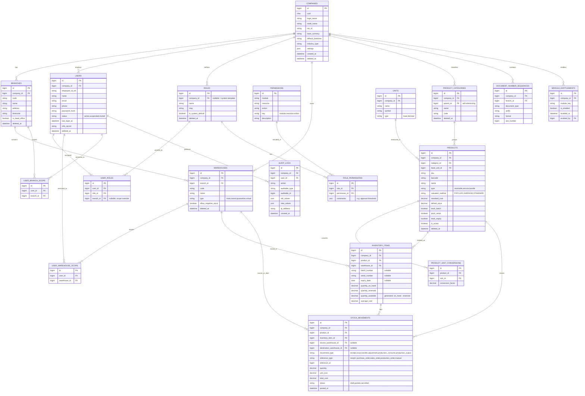

# 6. Database Design — Core (Phase 1)

This document covers the **foundation schema** shared by every other module:
tenancy (Company/Branch/Warehouse), identity (Users/Roles/Permissions), and the
Product/Inventory skeleton. Every later module's ERD extends this without
modifying it. Naming: `snake_case`, plural table names, singular FK columns
(`company_id`, not `companies_id`).

## 6.1 Conventions

- **Engine:** InnoDB (MySQL prod), SQLite (dev) — no engine-specific features (e.g. no MySQL generated columns unless polyfilled in SQLite via app logic).
- **Charset/Collation (MySQL):** `utf8mb4` / `utf8mb4_unicode_ci`.
- **Timestamps:** UTC, stored as `datetime`; converted to company timezone at the API/presentation layer.
- **Money columns:** `decimal(18,4)` — never float. Currency code stored alongside in a sibling `*_currency` column where the value isn't always company-base-currency.
- **Soft delete:** `deleted_at datetime null` on all tables listed as "Master Data" or "Transaction Header" below.
- **Every table** (unless noted "Global"): `id` (PK, BIGINT UNSIGNED, AUTO_INCREMENT), `uuid` (CHAR 36, unique, indexed), `company_id` (FK, indexed), `created_by`/`updated_by` (FK to users), `created_at`/`updated_at`, `deleted_at` (nullable).

## 6.2 Core ERD

## 6.3 Table Notes & Indexing

| Table | Key Indexes | Notes |
|---|---|---|
| `companies` | `tax_id` unique per instance; `uuid` unique | Root tenant table; no `company_id` on itself. |
| `branches` | `(company_id, code)` unique | `is_head_office` — exactly one true per company, enforced at app layer. |
| `warehouses` | `(company_id, code)` unique; `branch_id` indexed | `type=virtual` used for e.g. "in-transit" or "quality hold" logical warehouses without physical location. |
| `users` | `(company_id, email)` unique; `email` also globally indexed for login lookup pre-tenant-resolution | Password hashed with bcrypt/argon2id; `mfa_secret` encrypted at rest. |
| `roles` | `(company_id, slug)` unique where `company_id` not null; system templates have `company_id = null` | Cloning a template inserts a new row with the company's `company_id` and copies `role_permissions`. |
| `permissions` | `key` unique (Global table, no `company_id`) | Seeded from the matrix in `02-user-roles-permissions.md`; immutable via UI, only extendable via migration when new modules ship. |
| `role_permissions` | `(role_id, permission_id)` unique | `constraints` JSON holds e.g. `{"approval_threshold": 5000000, "currency":"IDR"}`. |
| `user_roles` | `(user_id, role_id, branch_id)` unique | A user can hold different roles per branch (e.g. Sales in Branch A, Warehouse in Branch B). |
| `products` | `(company_id, sku)` unique; `barcode` indexed; `category_id` indexed | `valuation_method` is set once at product creation and locked after first stock movement (business rule, see future Business Rules doc). |
| `inventory_items` | `(company_id, product_id, warehouse_id, batch_number, serial_number)` unique composite | This is the "stock on hand" table; `quantity_available` computed (generated column in MySQL, computed in app layer for SQLite). |
| `stock_movements` | `(company_id, product_id, created_at)`; `(reference_type, reference_id)` | Append-only ledger — never updated after `status=posted`, only reversed via a new compensating movement. Partitioning by `created_at` (yearly) planned once volume analysis in Phase 4 confirms need. |
| `audit_logs` | `(company_id, auditable_type, auditable_id)`; `(user_id, created_at)` | Append-only; retention policy configurable per company (default 3 years), archival job moves cold rows to cheaper storage rather than deleting. |
| `module_entitlements` | `(company_id, module_key)` unique | Drives both menu rendering (frontend) and route middleware (backend) — disabling a module sets `is_enabled=false`; data is retained, not deleted. |

## 6.4 Multi-Tenancy Enforcement Strategy

- Laravel **global scope** (`CompanyScope`) applied to every Eloquent model with a `company_id` column — automatically injects `WHERE company_id = :current_company_id` on every query, including relations.
- `current_company_id` resolved from the authenticated user's JWT claim (`company_id`), never from client-supplied request data.
- Cross-company access (e.g. Super Admin support impersonation, consolidated multi-company reporting for Company Owners who own multiple legal entities) uses an explicit, logged `withoutCompanyScope()` escape hatch gated by a dedicated permission (`platform.impersonate`, `reports.consolidated.view`), never implicit.
- Branch/Warehouse scoping (`user_branch_scope`, `user_warehouse_scope`) is a **second, independent** scope layer applied on top of company scope for roles marked "Scoped" (`S`) in the permission matrix — e.g. Warehouse role only sees `inventory_items`/`stock_movements` for warehouses in their scope table.

## 6.5 Archival & Growth Strategy

- High-volume append-only tables (`stock_movements`, `audit_logs`, and later `gl_journal_lines`) are designed for eventual time-based partitioning in MySQL production; SQLite dev environments are expected to stay small and do not partition.
- Reporting queries against these tables go through materialized/cached summary tables (e.g. `inventory_balances_daily_snapshot`) rather than aggregating the full ledger live, once volume passes a configurable threshold — detailed in the Reports & Analytics module (Phase 8).
