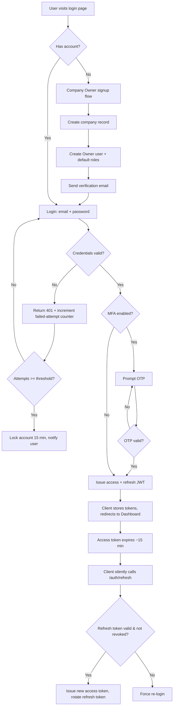

# 3. ERP Modules — Authentication

## Purpose

Provide secure, tenant-aware identity and session management for every user
type (platform Super Admin, company users, and future customer/supplier
portal Guests), and issue the JWT tokens that every other module's API relies
on for both authentication and authorization (via embedded role/permission
claims).

## Business Process

1. A Company Owner registers a new company (self-serve signup) or a Super
   Admin provisions a tenant on their behalf.
2. The Owner invites users by email; invited users set a password and
   complete profile setup on first login.
3. Users authenticate with email + password (+ optional MFA); receive a
   short-lived access token and a longer-lived refresh token.
4. Every subsequent API call carries the access token; the backend resolves
   `company_id`, `user_id`, active roles, and permission set from it.
5. Sessions can be revoked (logout, "log out all devices", admin-forced
   revocation on suspension) via a server-side token blacklist / refresh-token
   rotation table.

## Workflow

## Functional Requirements

| ID | Requirement |
|---|---|
| AUTH-F1 | System supports email/password registration for Company Owner (self-serve) and admin-initiated user invitation for all other roles. |
| AUTH-F2 | System issues JWT access tokens (15 min expiry) and refresh tokens (30 days, rotating on each use) via `/api/auth/login` and `/api/auth/refresh`. |
| AUTH-F3 | System supports optional TOTP-based MFA (Google Authenticator compatible) per user, and can be **mandated** per role by company policy (e.g. require MFA for Finance/Accounting roles). |
| AUTH-F4 | System supports "Remember this device" to skip MFA for 30 days per device fingerprint. |
| AUTH-F5 | System supports password reset via emailed time-limited (1 hour) tokenized link. |
| AUTH-F6 | System supports "Log out all devices" which revokes all refresh tokens for a user. |
| AUTH-F7 | System supports account lockout after N failed attempts (default 5, configurable per company) with exponential backoff. |
| AUTH-F8 | System supports Super Admin impersonation of a tenant user for support purposes, requiring: explicit Company Owner grant (time-boxed, max 4h), full audit log entry, visible "impersonation active" banner in UI for the duration. |
| AUTH-F9 | System embeds `company_id`, `user_id`, `role_ids`, and a permission-set version hash in the JWT payload; permission changes invalidate cached claims within 60s via a version-check on each request. |
| AUTH-F10 | System supports future SSO/SAML/OAuth2 as pluggable auth drivers without changing the JWT session contract downstream (extension point, not built in v1). |
| AUTH-F11 | System logs every login, logout, failed login, password reset, and impersonation event to `audit_logs`. |
| AUTH-F12 | System enforces password policy: min 10 chars, at least 1 number and 1 letter, checked against a common-password blocklist; configurable stricter policy per company. |

## Business Rules

1. A user belongs to exactly one company (`company_id` fixed at creation); a person needing access to multiple companies gets multiple user records (one per company), linked only conceptually by shared email for convenience, never merged in the data model.
2. Refresh tokens are single-use; reuse of an already-rotated refresh token immediately revokes the entire token family and forces re-login (replay-attack protection).
3. A suspended user (`users.status = suspended`) cannot log in even with a valid password; existing access tokens are invalidated within 60s via the permission-version check.
4. MFA secrets are never returned by any API response after initial setup (write-once, read-never field).
5. Password reset tokens are single-use and invalidate all other outstanding reset tokens for that user when used.
6. Impersonation sessions cannot perform destructive actions (delete company, delete users, change billing) regardless of the impersonated user's actual role — hard-blocked at the middleware level.
7. Account lockout duration doubles on each subsequent lockout within a rolling 24h window (15 min → 30 min → 60 min, capped).
8. Deleting (soft-deleting) a user immediately revokes all of that user's tokens and role assignments; the user row is retained for audit-log referential integrity.

## Validation

| Field | Rules |
|---|---|
| `email` | Required, valid email format, unique within `company_id` for regular users, globally unique for the login-lookup index. |
| `password` | Required on set, min 10 chars, 1 letter + 1 number, not in common-password blocklist, not equal to email/name. |
| `otp` | 6 digits, valid within 30s TOTP window (±1 window tolerance for clock drift). |
| `refresh_token` | Must exist, not expired, not previously rotated (single-use check). |

## Permissions

| Permission Key | Description |
|---|---|
| `auth.user.invite` | Invite a new user into the company. |
| `auth.user.suspend` | Suspend/reactivate a user. |
| `auth.session.revoke_all` | Force-logout another user's sessions (Owner/Director only). |
| `platform.impersonate` | Super Admin: request/perform impersonation (requires Owner grant). |
| `auth.mfa.enforce_policy` | Set company-wide MFA requirement per role. |

## Acceptance Criteria

- Given valid credentials and no MFA, login returns access + refresh tokens within 400ms P95.
- Given MFA-enabled user, login without OTP returns a `mfa_required` challenge state, not a full token pair.
- Given 5 consecutive failed logins, the 6th attempt is rejected with `423 Locked` even with correct credentials, until lockout expires.
- Given a rotated refresh token used a second time, the API returns `401` and all sibling tokens in that family are revoked (verifiable via `audit_logs`).
- Given a Company Owner grants a 4-hour impersonation window, the Super Admin can access tenant data only for that window and every action is tagged `performed_via_impersonation=true` in `audit_logs`.
- Given a role's permissions change, a user already logged in with that role loses/gains the corresponding UI menu items and API access within 60 seconds without needing to log out.

## API Requirements

| Method | Endpoint | Description |
|---|---|---|
| POST | `/api/auth/register-company` | Self-serve company + Owner signup. |
| POST | `/api/auth/login` | Email/password login; returns tokens or `mfa_required`. |
| POST | `/api/auth/mfa/verify` | Submit OTP to complete login. |
| POST | `/api/auth/refresh` | Exchange refresh token for new access token (rotates refresh token). |
| POST | `/api/auth/logout` | Revoke current session's refresh token. |
| POST | `/api/auth/logout-all` | Revoke all refresh tokens for current user. |
| POST | `/api/auth/password/forgot` | Request password reset email. |
| POST | `/api/auth/password/reset` | Reset password with token. |
| POST | `/api/auth/mfa/setup` | Generate TOTP secret + QR provisioning URI. |
| POST | `/api/auth/mfa/confirm` | Confirm MFA setup with first OTP. |
| DELETE | `/api/auth/mfa` | Disable MFA (requires password re-confirmation). |
| GET | `/api/auth/me` | Current user profile + roles + permission keys. |
| POST | `/api/auth/impersonate/request` | Super Admin requests impersonation grant. |
| POST | `/api/auth/impersonate/approve` | Owner approves a pending impersonation request. |
| POST | `/api/auth/impersonate/start` | Start an approved impersonation session. |
| POST | `/api/auth/impersonate/end` | End impersonation session early. |

All endpoints return the standard envelope from `00-README.md` §Global
Conventions; auth failures use error codes `INVALID_CREDENTIALS`,
`MFA_REQUIRED`, `MFA_INVALID`, `ACCOUNT_LOCKED`, `ACCOUNT_SUSPENDED`,
`TOKEN_EXPIRED`, `TOKEN_REUSED`.

## UI Requirements

**Pages:** Login, MFA Challenge, Forgot Password, Reset Password, Company Signup
(multi-step wizard: Company Info → Owner Account → Industry Template →
Confirm), MFA Setup (Settings > Security), Active Sessions list (Settings >
Security, with per-session revoke), Impersonation Request/Approval screen.

**Components (FlyonUI):** Card-based auth layout (centered, brand panel
optional), Input with inline validation, OTP input group (6 boxes), Toast for
error/success feedback, Stepper component for signup wizard, Table for Active
Sessions, Modal for "confirm logout all devices", Badge ("Impersonation
Active") pinned in navbar when applicable.
