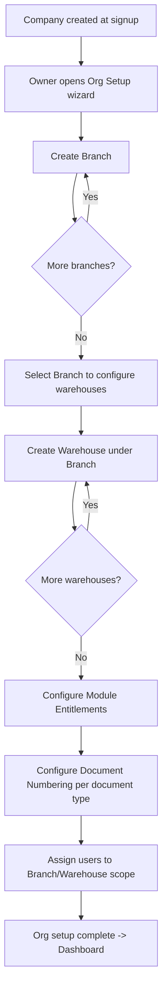

# 3. ERP Modules — Company, Branch, Warehouse

## Purpose

Establish the tenancy hierarchy — **Company → Branch → Warehouse** — that every
transactional module scopes against, and give Company Owners self-service
control over module enablement, numbering formats, and org structure.

## Business Process

1. Owner completes company profile (legal name, tax ID, base currency,
   industry template) during signup.
2. Owner creates one or more Branches (physical or logical business
   locations — e.g. "Jakarta HQ", "Surabaya Store").
3. Owner or Warehouse-permitted user creates one or more Warehouses per
   Branch (physical stock locations, plus optional virtual warehouses like
   "In Transit" or "QC Hold").
4. Owner enables/disables modules per company from the Module Entitlements
   screen; disabling a module hides its menu and blocks its API routes but
   retains its data.
5. Owner configures document numbering sequences per branch per document
   type.

## Workflow

## Functional Requirements

| ID | Requirement |
|---|---|
| ORG-F1 | System supports unlimited Branches per Company (subject to subscription tier limits enforced by `module_entitlements`/billing, not hardcoded). |
| ORG-F2 | System supports unlimited Warehouses per Branch, including virtual warehouse types (`transit`, `quarantine`, `virtual`) that do not require a physical address. |
| ORG-F3 | Exactly one Branch per Company must be flagged `is_head_office = true`; used as default for company-level reports and as the fallback branch for users without explicit branch scope. |
| ORG-F4 | Owner can enable/disable any module listed in `module_entitlements`; disabling cascades to hide menu items, block API routes (`403 MODULE_DISABLED`), and hide the module's dashboard widgets — without deleting underlying data. |
| ORG-F5 | Some modules declare hard dependencies (e.g. `manufacturing` requires `inventory`); attempting to enable a dependent module without its dependency returns a validation error listing missing prerequisites. |
| ORG-F6 | System supports per-branch, per-document-type numbering sequences with configurable prefix/format/reset-frequency (never, yearly, monthly). |
| ORG-F7 | System supports assigning users to one or more Branches/Warehouses via `user_branch_scope`/`user_warehouse_scope`, restricting their visible data accordingly for "Scoped" roles. |
| ORG-F8 | System supports Company-level settings: base currency, fiscal year start month, default tax rate references, timezone, address, logo, industry template selection. |
| ORG-F9 | System supports Warehouse-level setting `allow_negative_stock` (default false) that overrides the company default for that warehouse specifically (e.g. a retail POS warehouse might allow it, a controlled pharma warehouse must not). |
| ORG-F10 | Deactivating (not deleting) a Branch or Warehouse blocks new transactions against it but preserves historical reporting; requires zero open transactions (draft POs, unposted stock movements) before deactivation is allowed. |

## Business Rules

1. A Company cannot be deleted while it has any non-cancelled transactional records; only Super Admin can hard-delete a company, and only after a 30-day soft-delete grace period with the Owner notified.
2. Changing `base_currency` after any transaction has been posted is blocked — base currency is locked at first posted transaction to preserve GL integrity.
3. A Warehouse's `branch_id` cannot be changed once stock movements exist against it (would corrupt branch-level reporting); must deactivate and create a new warehouse instead.
4. Disabling a module with existing open (non-final-status) documents (e.g. disabling Manufacturing with active Production Orders) is blocked until those documents reach a terminal status or are explicitly force-closed by the Owner with a warning.
5. Document numbering sequences are strictly monotonic per `(company_id, branch_id, document_type)` — never reused, even if the originating document is later voided (voided documents keep their number, marked void).
6. A user with warehouse scope restricted to Warehouse A cannot create a stock transfer that has Warehouse B as the source, only as a destination they're receiving into (if also scoped to B) — enforced at API layer, not just UI hiding.
7. At least one Branch and one Warehouse must exist and be active for any transactional module (Sales, Purchasing, Inventory) to be usable; the setup wizard cannot be skipped past this point.

## Validation

| Field | Rules |
|---|---|
| `company.legal_name` | Required, max 255 chars. |
| `company.tax_id` | Required, format validated per company's country (pluggable validator), unique within instance. |
| `company.base_currency` | Required, ISO 4217 code, immutable after first posted transaction. |
| `branch.code` | Required, unique per company, max 10 chars, uppercase alphanumeric. |
| `warehouse.code` | Required, unique per company, max 10 chars. |
| `warehouse.type` | Enum: `main`, `transit`, `quarantine`, `virtual`. |
| `document_number_sequences.format` | Required, must contain a numeric placeholder token (e.g. `{seq:6}`) and may contain `{year}`, `{month}`, `{branch_code}`. |

## Permissions

| Permission Key | Description |
|---|---|
| `company.settings.edit` | Edit company profile/settings. |
| `company.module.toggle` | Enable/disable modules. |
| `branch.*` | Full CRUD on branches. |
| `warehouse.*` | Full CRUD on warehouses. |
| `warehouse.view` (scoped) | View own scoped warehouse(s) only — Warehouse role default. |
| `numbering.configure` | Edit document numbering sequences. |
| `user.scope.assign` | Assign branch/warehouse scope to users. |

## Acceptance Criteria

- Given no Branch exists, the Sales/Purchasing/Inventory menu items are hidden or show a "Complete org setup" prompt instead of their normal UI.
- Given a module is disabled, calling its API returns `403` with `error.code = MODULE_DISABLED` and the frontend redirects away from any deep link into that module.
- Given a Warehouse has open stock movements, attempting to deactivate it returns a validation error listing the blocking records.
- Given two branches "JKT" and "SBY" both configured with format `PO-{branch_code}-{year}-{seq:6}`, POs created in each branch get independently incrementing sequences (e.g. `PO-JKT-2026-000001` and `PO-SBY-2026-000001` can coexist).
- Given a user scoped only to Warehouse A, GET `/api/inventory?warehouse_id=B` returns `403` even if they otherwise hold the Warehouse role.

## API Requirements

| Method | Endpoint | Description |
|---|---|---|
| GET/PUT | `/api/company` | View/update company profile & settings. |
| GET | `/api/company/module-entitlements` | List all modules + enabled state + dependency info. |
| PUT | `/api/company/module-entitlements/{module_key}` | Enable/disable a module. |
| GET/POST | `/api/branches` | List / create branches. |
| GET/PUT/DELETE | `/api/branches/{id}` | View/update/deactivate a branch. |
| GET/POST | `/api/warehouses` | List / create warehouses (filterable by `branch_id`). |
| GET/PUT/DELETE | `/api/warehouses/{id}` | View/update/deactivate a warehouse. |
| GET/POST | `/api/document-number-sequences` | List / create numbering sequences. |
| PUT | `/api/document-number-sequences/{id}` | Update format/prefix/reset policy. |
| POST | `/api/users/{id}/branch-scope` | Assign branch scope. |
| POST | `/api/users/{id}/warehouse-scope` | Assign warehouse scope. |
| GET | `/api/users/{id}/scope` | View a user's current branch/warehouse scope. |

## UI Requirements

**Pages:** Org Setup Wizard (multi-step), Company Settings, Branches List +
Branch Detail Drawer, Warehouses List + Warehouse Detail Drawer, Module
Entitlements grid, Document Numbering configuration table, User Scope
assignment screen (per-user branch/warehouse checklist).

**Components (FlyonUI):** Stepper (setup wizard), Data Table with inline
status Badge (active/inactive) for Branches/Warehouses, Toggle switches
(Module Entitlements grid — one row per module, dependency tooltip on
disabled toggles), Drawer for create/edit forms, Accordion for grouping
numbering sequences by document type, Multi-select checklist component for
warehouse/branch scope assignment, Empty State illustration for "no branches
yet" first-run.
