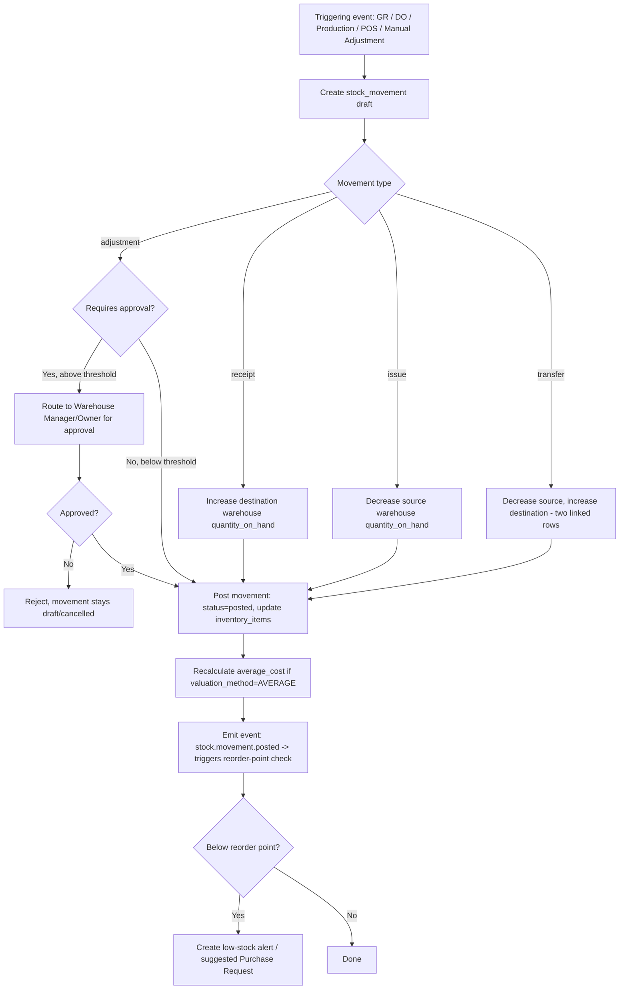

# 3. ERP Modules — Products, Categories, Units, Inventory, Stock Movement

## Purpose

Provide the master data (Products, Categories, Units) and real-time stock
ledger (Inventory Items, Stock Movements) that every downstream module
(Purchasing, Sales, Manufacturing, POS) reads from and writes to. This is the
single source of truth for "what do we have, where, and what did it cost."

## Business Process

1. Setup: define Units (base + derived with conversion factors), Product
   Categories (hierarchical), then Products (linked to a category + base
   unit + valuation method).
2. Opening balances: initial stock is entered via a special "Opening Balance"
   stock movement type per warehouse, requiring approval.
3. Ongoing: every module that changes stock (Goods Receipt, Delivery Order,
   Production Order, POS sale, manual Stock Adjustment, Stock Transfer)
   creates `stock_movements` records; `inventory_items.quantity_on_hand` is
   updated transactionally in the same DB transaction as the movement insert.
4. Reservation: Sales Orders and Production Orders can reserve stock
   (`quantity_reserved`) ahead of actual movement, so `quantity_available`
   reflects true sellable/usable stock.
5. Period-end: stock valuation reports run off `inventory_items` +
   `stock_movements` using the product's configured valuation method.

## Workflow — Stock Movement (generic)

## Functional Requirements

### Product / Category / Unit

| ID | Requirement |
|---|---|
| INV-F1 | System supports hierarchical Product Categories (unlimited depth) for classification and category-level reporting/pricing rules. |
| INV-F2 | System supports Units with base/derived relationships and conversion factors (e.g. 1 Box = 12 Pcs); transactions can be entered in any linked unit and are stored internally in base unit. |
| INV-F3 | System supports Product types: `stockable` (tracked in inventory), `service` (never inventoried, e.g. labor), `bundle` (composed of other products, exploded at transaction time or tracked as its own SKU per company setting). |
| INV-F4 | System supports per-product valuation method: FIFO, LIFO, Weighted Average, Standard Cost — selectable at creation, locked after first stock movement. |
| INV-F5 | System supports batch tracking (`track_batch`), serial number tracking (`track_serial`), and expiry date tracking (`track_expiry`) per product, independently togglable, relevant for Healthcare/Pharmacy/Manufacturing industries. |
| INV-F6 | System supports multiple barcodes per product (e.g. different barcodes per packaging unit) via a `product_barcodes` child table. |
| INV-F7 | System supports product images (multiple, one primary) and file attachments (spec sheets, MSDS for pharma/chemical). |
| INV-F8 | System supports reorder point and reorder quantity per product per warehouse (`product_warehouse_settings` child table), driving low-stock alerts. |

### Inventory / Stock Movement

| ID | Requirement |
|---|---|
| INV-F9 | System maintains real-time `quantity_on_hand`, `quantity_reserved`, `quantity_available` per product per warehouse (+ batch/serial where tracked). |
| INV-F10 | Every change to stock is recorded as an immutable `stock_movements` row; `inventory_items` balances are derived/cached, never the sole source of truth (rebuildable by replaying movements). |
| INV-F11 | System supports Stock Transfer between warehouses (same or different branches), generating linked issue+receipt movement pairs, with an optional "in-transit" intermediate state using a virtual `transit` warehouse. |
| INV-F12 | System supports Stock Adjustment (manual quantity correction) with mandatory reason code and, above a configurable value threshold, mandatory approval. |
| INV-F13 | System supports Stock Opname/Count: generate a count sheet (optionally filtered by category/warehouse/zone), record counted quantities, produce variance report, and post adjustment movements for variances upon approval. |
| INV-F14 | System prevents negative stock by default (`allow_negative_stock=false`), configurable per warehouse; if disallowed, any movement that would drop `quantity_on_hand` below zero is rejected with `INSUFFICIENT_STOCK`. |
| INV-F15 | System supports stock reservation (soft-allocate) from confirmed Sales Orders / Production Orders without moving physical stock, reducing `quantity_available` only. |
| INV-F16 | System recalculates weighted-average cost on every receipt movement for products using `AVERAGE` valuation; FIFO/LIFO layer tracking maintained via a `stock_cost_layers` table consumed in order on issue movements. |
| INV-F17 | System supports low-stock and expiry-approaching alerts, feeding the Notification Center (Section 12) and suggesting Purchase Requests. |

## Business Rules

1. A product's `valuation_method` cannot be changed once any `stock_movements` row references it.
2. `quantity_available` is always `quantity_on_hand - quantity_reserved`; never stored independently, always computed.
3. Negative stock is blocked at warehouses with `allow_negative_stock=false`; the one exception is a correcting `adjustment` movement explicitly flagged `force_negative_override=true`, which requires Owner/Finance approval and is flagged in reports.
4. FIFO/LIFO issue movements must consume `stock_cost_layers` strictly in the applicable order; partial-layer consumption splits the layer row rather than deleting it, to preserve audit trail.
5. Stock Transfers between warehouses in different branches trigger an inter-branch reporting flag but do not by themselves create GL entries unless Accounting module is enabled and inter-branch transfer pricing is configured (see future Accounting module doc).
6. Batch/serial-tracked products cannot be received or issued without specifying the batch/serial at the line level — enforced as a hard validation, not a warning.
7. Expiry-tracked products issued via FIFO must, by default, consume the earliest-expiring batch first (FEFO override option available per company, since First-Expiry-First-Out sometimes takes priority over First-In-First-Out for pharma/food).
8. A Stock Opname in progress locks the counted warehouse's manual adjustments (but not normal sales/purchase movements, which continue and are reconciled against the count baseline timestamp) to prevent race conditions.
9. Reorder point evaluation runs on every posted movement that decreases `quantity_available`, not on a batch schedule, so alerts are near-real-time.
10. Deleting a Product is blocked if any `stock_movements` reference it; it can only be deactivated (`is_active=false`), which hides it from new-transaction pickers but preserves historical reporting.
11. Unit conversion factors cannot be edited once transactions exist using that unit for that product, to prevent retroactive quantity distortion.

## Validation

| Field | Rules |
|---|---|
| `product.sku` | Required, unique per company, max 50 chars, alphanumeric + `-_`. |
| `product.category_id` | Required, must reference an active category in same company. |
| `product.base_unit_id` | Required, must reference an active unit in same company. |
| `product.valuation_method` | Enum: `FIFO`, `LIFO`, `AVERAGE`, `STANDARD`; immutable post-first-movement. |
| `stock_movement.quantity` | Required, > 0 (direction determined by `movement_type`, never negative quantities). |
| `stock_movement.batch_number` | Required if `product.track_batch = true`, else must be null. |
| `stock_movement.serial_number` | Required if `product.track_serial = true`; must be unique per product across all warehouses while `quantity_on_hand > 0` for that serial. |
| `unit_conversion.factor` | Required, > 0, immutable after first use. |

## Permissions

| Permission Key | Description |
|---|---|
| `product.*` | CRUD on products (typically Purchasing/Owner/Director). |
| `product-category.*` | CRUD on categories. |
| `unit.*` | CRUD on units. |
| `inventory.view` (scoped) | View stock levels — scoped to assigned warehouse(s) for Warehouse role. |
| `inventory.adjustment.create` | Create a stock adjustment. |
| `inventory.adjustment.approve` | Approve adjustments above threshold. |
| `inventory.transfer.create` | Initiate a stock transfer. |
| `inventory.transfer.receive` | Confirm receipt at destination warehouse. |
| `inventory.opname.*` | Full stock count lifecycle. |
| `inventory.negative_override` | Force-post a movement that would breach zero stock. |

## Acceptance Criteria

- Given a product with `track_batch=true`, submitting a Goods Receipt line without a batch number returns a validation error and does not post.
- Given a warehouse with `allow_negative_stock=false` and 10 units on hand, issuing 15 units returns `INSUFFICIENT_STOCK` and no movement is posted.
- Given a FIFO product received in two layers (100 units @ 10,000 then 50 units @ 11,000), issuing 120 units consumes 100 @ 10,000 + 20 @ 11,000, and the remaining layer shows 30 units @ 11,000.
- Given a Stock Opname is submitted with variances, posting the count creates exactly one `adjustment` stock movement per product per warehouse with the net variance quantity, referencing the opname document.
- Given a product drops below its configured reorder point after a posted issue movement, a low-stock alert record is created within the same request cycle (synchronous check, not next-day batch job).
- Given a Stock Transfer from Warehouse A to Warehouse B is created, exactly two `stock_movements` rows are created (issue from A, receipt to B) sharing a common `reference_id`, and `quantity_on_hand` at A decreases while B increases by the same transferred quantity.

## API Requirements

| Method | Endpoint | Description |
|---|---|---|
| GET/POST | `/api/products` | List (paginated, filterable by category/warehouse/status) / create products. |
| GET/PUT/DELETE | `/api/products/{id}` | View/update/deactivate a product. |
| POST | `/api/products/import` | Bulk import via CSV/XLSX template. |
| GET | `/api/products/export` | Bulk export (filtered). |
| GET/POST | `/api/product-categories` | List (tree) / create categories. |
| GET/POST | `/api/units` | List / create units + conversions. |
| GET | `/api/inventory` | Stock on hand, filterable by product/warehouse/batch, scoped by user's warehouse access. |
| GET | `/api/inventory/valuation` | Stock valuation report snapshot (method-aware). |
| POST | `/api/stock-movements/adjustment` | Create a stock adjustment. |
| POST | `/api/stock-movements/transfer` | Create a stock transfer (issue+receipt pair). |
| POST | `/api/stock-movements/transfer/{id}/receive` | Confirm receipt at destination. |
| GET | `/api/stock-movements` | Movement ledger, filterable by product/warehouse/date/type/reference. |
| POST | `/api/stock-opname` | Create a count session (generates count sheet). |
| PUT | `/api/stock-opname/{id}/counts` | Submit counted quantities. |
| POST | `/api/stock-opname/{id}/post` | Post variance adjustments after approval. |
| GET | `/api/products/{id}/reorder-alerts` | Current reorder status across warehouses. |

## UI Requirements

**Pages:** Product List (Table with filters: category, status, stock level),
Product Detail/Edit (Tabs: General, Pricing, Inventory Settings, Units,
Barcodes, Attachments), Category Tree Manager, Unit & Conversion Manager,
Stock Overview (per-warehouse grid), Stock Movement Ledger (Table,
exportable), Stock Transfer Create/Detail, Stock Adjustment Create/Detail,
Stock Opname session (count-sheet entry screen, optimized for tablet/barcode
scanner use), Low Stock Alerts panel.

**Components (FlyonUI):** Data Table w/ server-side pagination & column
filters (Product List, Movement Ledger), Tabs (Product Detail), Tree view
component (Category Manager), Drawer (quick create Product/Category/Unit),
Badge (stock status: In Stock/Low/Out), Stepper-free inline quantity inputs
with unit-picker Dropdown, Modal (confirm negative-stock override, confirm
opname posting), Skeleton loaders for stock grids, Empty State for "no
products yet", Command Palette entry for quick product search (barcode
scan-to-search compatible), Timeline component on Product Detail showing
recent stock movement history.
