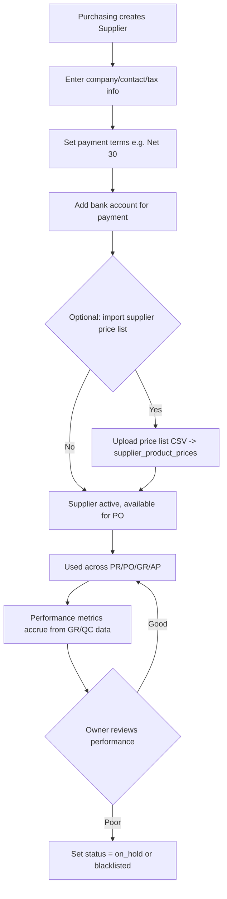

# 3. ERP Modules — Supplier

## Purpose

Maintain the supplier (vendor) master data and supplier-specific commercial
terms (payment terms, price lists, lead times) that Purchase Requests,
Purchase Orders, Goods Receipts, and Accounting (AP) all depend on.

## Business Process

1. Purchasing creates a Supplier record with contact info, tax details,
   payment terms, and bank account(s) for payment.
2. Optionally, Supplier is linked to one or more Product price lists
   (`supplier_product_prices`) for automated PO pricing and lead-time
   estimation.
3. Supplier status (`active`, `on_hold`, `blacklisted`) gates whether new
   Purchase Orders can be raised against them.
4. Supplier performance (on-time delivery %, rejection rate from QC) is
   tracked passively from Goods Receipt/QC data and surfaced on the Supplier
   Detail page (read-only rollup, not manually entered).

## Workflow

## Functional Requirements

| ID | Requirement |
|---|---|
| SUP-F1 | System supports full CRUD for Supplier master data: legal name, trade name, tax ID, addresses (billing/shipping, multiple), contacts (multiple, with role tags e.g. Sales Rep, Finance Contact). |
| SUP-F2 | System supports multiple bank accounts per supplier, one marked primary, used to prefill Payment records. |
| SUP-F3 | System supports configurable payment terms per supplier (e.g. Net 15/30/60, COD, Prepaid), used to auto-calculate invoice due dates. |
| SUP-F4 | System supports supplier-specific product price lists with effective date ranges, feeding PO line default pricing. |
| SUP-F5 | System supports Supplier status: `active`, `on_hold` (existing POs continue, no new POs), `blacklisted` (no new POs, flagged in UI). |
| SUP-F6 | System computes and displays (read-only) supplier performance metrics: on-time delivery rate, average lead time actual vs. quoted, QC rejection rate — derived from Goods Receipt and Quality Control records. |
| SUP-F7 | System supports supplier categorization/tagging (e.g. "Raw Material", "MRO", "Services") for filtering and spend analysis. |
| SUP-F8 | System supports document attachments per supplier (contracts, certifications — relevant for Healthcare/Pharma/Manufacturing compliance). |
| SUP-F9 | System supports multi-currency suppliers (supplier's transaction currency independent of company base currency). |

## Business Rules

1. A Supplier cannot be deleted if any Purchase Order, Goods Receipt, or Payment references it; only deactivation is allowed.
2. Setting a Supplier to `blacklisted` blocks creation of new Purchase Requests/Orders against them but does not affect already-open documents (which must be manually cancelled or completed).
3. Only one bank account per supplier can be `is_primary=true`; setting a new primary automatically unsets the previous one.
4. Supplier price list entries with overlapping effective date ranges for the same product are rejected at save time.
5. Performance metrics are recalculated on every Goods Receipt/QC posting, not on a nightly batch, so the Supplier Detail page is always current as of the last transaction.
6. Tax ID uniqueness is validated per company (two suppliers with the same tax ID in one company is blocked as likely duplicate entry) but not globally (same supplier legitimately serving multiple unrelated tenant companies is fine).

## Validation

| Field | Rules |
|---|---|
| `name` | Required, max 255 chars. |
| `tax_id` | Optional (some suppliers are individuals/informal), but if present must be unique per company. |
| `payment_terms_days` | Integer, >= 0. |
| `status` | Enum: `active`, `on_hold`, `blacklisted`. |
| `bank_account.account_number` | Required if bank account added, numeric/alphanumeric per bank format. |
| `supplier_product_prices.effective_from/to` | `effective_to` must be null or after `effective_from`; no overlap for same product. |

## Permissions

| Permission Key | Description |
|---|---|
| `supplier.view` | View supplier list/detail. |
| `supplier.create` / `supplier.edit` | Create/edit supplier master data. |
| `supplier.delete` | Deactivate a supplier. |
| `supplier.status.change` | Change status (on_hold/blacklist) — typically Purchasing Manager/Owner. |
| `supplier.price-list.manage` | Manage supplier price lists. |

## Acceptance Criteria

- Given a supplier with open POs is set to `blacklisted`, existing POs remain editable/receivable but the "Create PO" action for that supplier is disabled with an explanatory tooltip.
- Given a supplier has two price list entries for the same product with overlapping dates, saving the second returns a validation error identifying the conflict.
- Given a Goods Receipt is posted 3 days late against its PO's expected date, the supplier's on-time-delivery rollup recalculates and reflects the late delivery on next page load.
- Given a supplier is referenced by any PO, attempting `DELETE /api/suppliers/{id}` returns `409 SUPPLIER_IN_USE` and the record is only soft-deactivated via a separate endpoint, not deleted.

## API Requirements

| Method | Endpoint | Description |
|---|---|---|
| GET/POST | `/api/suppliers` | List (filter by status/tag) / create. |
| GET/PUT/DELETE | `/api/suppliers/{id}` | View/update/deactivate. |
| POST | `/api/suppliers/import` | Bulk import CSV/XLSX. |
| GET | `/api/suppliers/export` | Bulk export. |
| GET/POST | `/api/suppliers/{id}/bank-accounts` | Manage bank accounts. |
| GET/POST | `/api/suppliers/{id}/price-list` | Manage supplier price list entries. |
| GET | `/api/suppliers/{id}/performance` | Read-only performance rollup. |
| PUT | `/api/suppliers/{id}/status` | Change status with reason note. |

## UI Requirements

**Pages:** Supplier List (Table, filters: status/tag/category), Supplier
Detail (Tabs: General, Contacts, Bank Accounts, Price List, Performance,
Documents, Purchase History), Supplier Create/Edit Drawer.

**Components (FlyonUI):** Data Table, Tabs, Badge (status color-coded:
green=active, amber=on_hold, red=blacklisted), Avatar (supplier logo
placeholder), Timeline (purchase history on Detail page), Chart (performance
trend — on-time % over time), Drawer (create/edit), Toast (import
success/failure summary), Empty State ("No suppliers yet — import or add
your first supplier").
