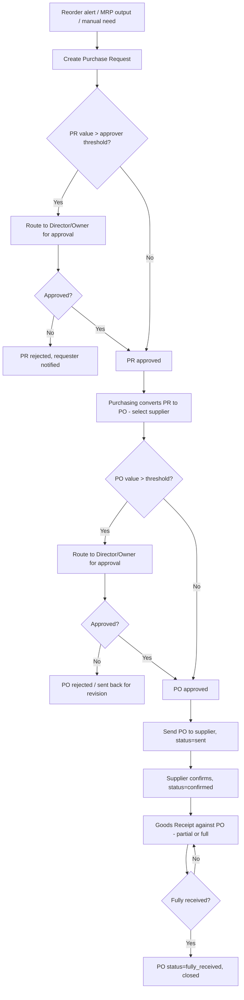

# 3. ERP Modules — Purchase Request & Purchase Order

## Purpose

Formalize internal demand (Purchase Request) and convert approved demand into
a binding commercial commitment to a Supplier (Purchase Order), with
appropriate approval gates before money is committed.

## Business Process — Purchase Request (PR)

1. Any permitted role (Warehouse, Production, Purchasing, or department
   heads) raises a PR listing needed products/quantities and a needed-by
   date, optionally referencing a triggering reorder alert or MRP output.
2. PR routes through an approval chain based on estimated total value
   (configurable thresholds per role, see `02-user-roles-permissions.md`).
3. Approved PRs appear in Purchasing's queue to be converted into one or more
   POs (splitting by supplier if a PR spans multiple preferred suppliers).

## Business Process — Purchase Order (PO)

1. Purchasing creates a PO either from an approved PR or directly (ad-hoc,
   still requires approval per company policy).
2. PO lines reference Products, quantities, unit price (defaulted from
   supplier price list, editable), expected delivery date, and destination
   warehouse.
3. PO routes through approval if above the configured value threshold.
4. Approved PO is sent to supplier (status `sent`); supplier confirms
   (status `confirmed`) — confirmation can be manual (Purchasing marks it)
   or via a future supplier portal.
5. PO is received (partially or fully) via Goods Receipt; PO status updates
   to `partially_received` / `fully_received`.
6. PO can be revised (with version history) before full receipt; cannot be
   revised after `fully_received`.

## Workflow

## Functional Requirements — Purchase Request

| ID | Requirement |
|---|---|
| PR-F1 | System supports PR creation with multi-line items (product, quantity, unit, needed-by date, notes), optionally auto-populated from a low-stock alert or MRP suggestion. |
| PR-F2 | System routes PR for approval based on estimated total value against company-configured thresholds; multi-level approval chains supported (e.g. Director then Owner above a higher threshold). |
| PR-F3 | System supports PR rejection with mandatory reason, returned to requester for revision or cancellation. |
| PR-F4 | System supports partial conversion of a PR into multiple POs (e.g. splitting lines across two preferred suppliers). |
| PR-F5 | System tracks PR → PO linkage for full traceability (one PR can spawn multiple POs; one PO can consolidate multiple PRs). |

## Functional Requirements — Purchase Order

| ID | Requirement |
|---|---|
| PO-F1 | System supports PO creation from one or more approved PRs, or ad-hoc (direct), per company policy toggle (`require_pr_before_po`). |
| PO-F2 | System defaults PO line pricing from the supplier's active price list, editable per line with an audit note if changed. |
| PO-F3 | System supports PO approval workflow mirroring PR (value-based thresholds, multi-level). |
| PO-F4 | System supports PO revision (change quantity/price/date) prior to full receipt, maintaining version history (`purchase_order_revisions`); revisions above a value-change threshold re-trigger approval. |
| PO-F5 | System supports PO cancellation (full or line-level) prior to any receipt; partial cancellation after partial receipt closes only the un-received remainder. |
| PO-F6 | System supports PO status lifecycle: `draft` → `pending_approval` → `approved` → `sent` → `confirmed` → `partially_received` → `fully_received` / `cancelled`. |
| PO-F7 | System generates a printable/emailable PO document (PDF) using company branding and supplier's language/currency preference. |
| PO-F8 | System supports PO-level and line-level expected delivery dates, feeding supplier performance tracking. |
| PO-F9 | System supports multi-currency POs; PO total is stored in both transaction currency and company base currency using the exchange rate at approval time (rate locked, not re-fetched later). |
| PO-F10 | System supports blanket/standing POs (a PO with a total value cap, drawn down via multiple Goods Receipts over a validity period) — configurable per company as an advanced feature. |

## Business Rules

1. A PO cannot be created against a `blacklisted` supplier.
2. A PO's total value approval threshold is evaluated on the transaction-currency amount converted to base currency at the current rate, not the raw foreign-currency figure.
3. PO line unit price, if manually overridden below/above the supplier price list by more than a configurable % (default 10%), requires a mandatory justification note.
4. A PO cannot be cancelled if any Goods Receipt already exists against it — only the un-received remainder can be closed/cancelled.
5. Segregation of duties: the user who created a PO cannot also be the sole approver, even if their role's threshold would technically permit it (self-approval blocked at the application layer, not just UI).
6. PR-to-PO conversion is not required if `require_pr_before_po=false` at company level, but the setting cannot be changed retroactively for already-open PRs (grandfathered).
7. A PO revision that changes total value by more than a configurable % (default 15%) after initial approval re-enters the approval workflow from the top, even if the new value is still under the original threshold, since the price itself changed materially.
8. Once `fully_received`, a PO is immutable except for its status and linked accounting entries; no further line edits are permitted.

## Validation

| Field | Rules |
|---|---|
| `purchase_request.lines[].quantity` | Required, > 0. |
| `purchase_request.needed_by_date` | Required, must be today or future. |
| `purchase_order.supplier_id` | Required, supplier must be `active`. |
| `purchase_order.lines[].unit_price` | Required, >= 0. |
| `purchase_order.lines[].warehouse_id` | Required, must be an active warehouse the requesting branch has access to. |
| `purchase_order.currency` | Required, ISO 4217; exchange rate required if != company base currency. |

## Permissions

| Permission Key | Description |
|---|---|
| `purchase-request.create` / `.edit` / `.view` | PR CRUD. |
| `purchase-request.approve` | Approve/reject PR (thresholded). |
| `purchase-order.create` / `.edit` / `.view` | PO CRUD. |
| `purchase-order.approve` | Approve/reject PO (thresholded, excludes self-approval). |
| `purchase-order.cancel` | Cancel PO/lines. |
| `purchase-order.revise` | Create a PO revision. |
| `purchase-order.send` | Mark PO as sent to supplier (triggers PDF/email). |

## Acceptance Criteria

- Given a PR total of 50,000,000 IDR and an approval threshold of 20,000,000 for Director, the PR routes to Director for approval and is blocked from PO conversion until approved.
- Given a user without `purchase-order.approve` beyond their own threshold attempts to approve their own created PO, the API returns `403 SELF_APPROVAL_BLOCKED` regardless of role.
- Given a PO with 3 lines has 1 line fully received and 2 lines pending, PO status is `partially_received`, and only the 2 pending lines remain editable/cancellable.
- Given a PO revision changes total value from 10,000,000 to 12,500,000 (25% increase, above the 15% re-approval threshold), the revision re-enters `pending_approval` even though 12,500,000 is still under the 20,000,000 Director threshold.
- Given a blacklisted supplier, `POST /api/purchase-orders` with that `supplier_id` returns `422 SUPPLIER_BLACKLISTED`.

## API Requirements

| Method | Endpoint | Description |
|---|---|---|
| GET/POST | `/api/purchase-requests` | List / create PR. |
| GET/PUT/DELETE | `/api/purchase-requests/{id}` | View/update/cancel PR. |
| POST | `/api/purchase-requests/{id}/approve` | Approve PR. |
| POST | `/api/purchase-requests/{id}/reject` | Reject PR with reason. |
| POST | `/api/purchase-requests/{id}/convert-to-po` | Convert (all/partial lines) to a new PO. |
| GET/POST | `/api/purchase-orders` | List / create PO. |
| GET/PUT | `/api/purchase-orders/{id}` | View/update PO (pre-approval only). |
| POST | `/api/purchase-orders/{id}/submit` | Submit for approval. |
| POST | `/api/purchase-orders/{id}/approve` | Approve PO. |
| POST | `/api/purchase-orders/{id}/reject` | Reject PO with reason. |
| POST | `/api/purchase-orders/{id}/send` | Mark sent, generate/email PDF. |
| POST | `/api/purchase-orders/{id}/confirm` | Record supplier confirmation. |
| POST | `/api/purchase-orders/{id}/revise` | Create a new revision. |
| POST | `/api/purchase-orders/{id}/cancel` | Cancel PO or specific lines. |
| GET | `/api/purchase-orders/{id}/pdf` | Generate PO document. |
| GET | `/api/purchase-orders/{id}/receipts` | List linked Goods Receipts. |

## UI Requirements

**Pages:** PR List (Table, filters: status/requester/department), PR
Create/Edit form, PR Approval queue (Owner/Director inbox), PO List (Table,
filters: status/supplier/branch), PO Create/Edit (line-item Table with
supplier price-list autocomplete), PO Detail (Tabs: Lines, Approval History,
Revisions, Receipts, Documents), PO Approval queue.

**Components (FlyonUI):** Data Table with status Badge chips, Drawer/full
page form for PR/PO creation with dynamic line-item Table (add/remove rows),
Autocomplete/Command Palette for product & supplier selection, Stepper-style
Timeline showing approval chain progress, Modal for approve/reject with
reason textarea, Tabs (PO Detail), Toast for submit/approve/reject
confirmations, Badge for currency indicator on multi-currency POs, Print/PDF
preview Modal.
