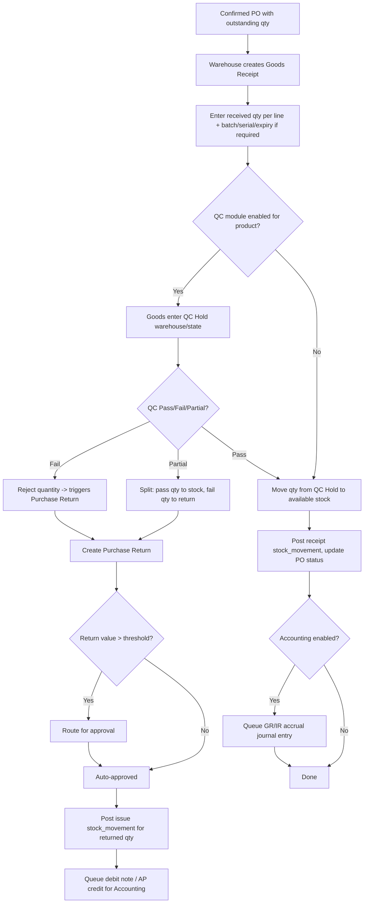

# 3. ERP Modules — Goods Receipt & Purchase Return

## Purpose

Record the physical receipt of goods against a Purchase Order (updating
inventory and supplier performance), and handle returning defective/excess
goods back to the supplier.

## Business Process — Goods Receipt (GR)

1. Warehouse staff selects an approved/confirmed PO with outstanding
   quantity, and records received quantities per line (may be less than
   ordered — partial receipt).
2. If the product requires batch/serial/expiry tracking, those are captured
   at receipt.
3. If Quality Control module is enabled for the product/category, received
   goods enter a QC hold state before being added to available stock.
4. On posting, a `receipt` stock movement is created per line, PO status
   updates, and (if Accounting enabled) a GR/IR (Goods Received/Invoice
   Received) accrual entry is queued for the Accounting module.

## Business Process — Purchase Return (PRet)

1. Warehouse or QC flags received goods as defective/wrong-item/excess.
2. A Purchase Return is created referencing the original GR, specifying
   return quantity and reason.
3. Return routes for approval if above threshold (returns affect supplier
   relationship and possibly AP credit).
4. On posting, an `issue` stock movement removes the returned quantity from
   inventory and a debit note / credit request is queued for Accounting.

## Workflow

## Functional Requirements — Goods Receipt

| ID | Requirement |
|---|---|
| GR-F1 | System supports creating a GR from one or more open PO lines (across possibly multiple POs from the same supplier delivered together). |
| GR-F2 | System supports partial receipt (received qty < ordered qty), leaving remaining qty open on the PO for future GRs. |
| GR-F3 | System supports over-receipt only if `allow_over_receipt` is enabled per company (default false), capped at a configurable tolerance % (default 5%). |
| GR-F4 | System captures batch/serial/expiry at the line level when required by the product's tracking flags (hard validation). |
| GR-F5 | System integrates with Quality Control (if enabled): received qty can be routed to a QC-hold status before becoming available stock. |
| GR-F6 | System auto-updates PO status (`partially_received`/`fully_received`) and supplier on-time performance metrics on posting. |
| GR-F7 | System generates a GR document (printable) for warehouse records and supplier proof-of-delivery matching. |
| GR-F8 | System supports GR against a Purchase Return context is disallowed — GR is receipt-only; the inverse flow is a separate document type (Purchase Return). |

## Functional Requirements — Purchase Return

| ID | Requirement |
|---|---|
| PRET-F1 | System supports creating a Purchase Return referencing an original GR (cannot exceed the received-and-not-yet-returned quantity per line). |
| PRET-F2 | System supports return reason codes: `defective`, `wrong_item`, `excess_quantity`, `expired`, `quality_failure`, `other` (with mandatory note for `other`). |
| PRET-F3 | System supports return resolution type: `replacement_expected`, `credit_note_expected`, `refund_expected` — informs downstream Accounting handling. |
| PRET-F4 | System supports approval routing for returns above a configurable value threshold. |
| PRET-F5 | System generates a return document (printable/emailable) for supplier communication. |

## Business Rules

1. A GR cannot receive more than the PO line's outstanding quantity unless `allow_over_receipt=true` and within tolerance %.
2. GR quantities for batch/serial-tracked products must exactly match the sum of batch/serial-level entries (no orphan quantity without a batch/serial tag).
3. Goods in QC-hold status are excluded from `quantity_available` (they exist in `inventory_items` with a distinct status/warehouse) until QC disposition is recorded.
4. A Purchase Return cannot exceed the net received-minus-already-returned quantity for its referenced GR line.
5. Posting a Purchase Return always creates a stock `issue` movement regardless of resolution type (physical goods leave the warehouse in all cases; only the financial resolution differs).
6. A GR posted against a PO that was subsequently revised (see PO module) is validated against the PO version active at the time the GR was created, not retroactively invalidated by later revisions — revisions after partial receipt only affect the un-received remainder.
7. Both GR and Purchase Return, once posted, are immutable (append-only); corrections are made via a new compensating document, never by editing a posted one.

## Validation

| Field | Rules |
|---|---|
| `goods_receipt.lines[].received_quantity` | Required, > 0, <= PO line outstanding qty (+tolerance if over-receipt allowed). |
| `goods_receipt.lines[].batch_number` | Required if product `track_batch=true`. |
| `purchase_return.lines[].return_quantity` | Required, > 0, <= net receivable-returnable qty for the referenced GR line. |
| `purchase_return.reason_code` | Required, enum as listed above. |

## Permissions

| Permission Key | Description |
|---|---|
| `goods-receipt.create` / `.view` | GR CRUD (Warehouse role primary). |
| `goods-receipt.qc.disposition` | Record QC pass/fail/partial (Production/QC role). |
| `purchase-return.create` / `.view` | Return CRUD. |
| `purchase-return.approve` | Approve returns above threshold. |

## Acceptance Criteria

- Given a PO line for 100 units, a GR for 60 units leaves 40 units outstanding and PO status `partially_received`; a second GR for the remaining 40 sets status `fully_received`.
- Given `allow_over_receipt=false`, a GR attempting 105 units against a 100-unit outstanding line is rejected with `422 OVER_RECEIPT_NOT_ALLOWED`.
- Given QC is enabled for a product and a GR is posted, the received quantity appears in a QC-hold state and does NOT count toward `quantity_available` until disposition is recorded.
- Given a Purchase Return references a GR line with 60 received and 10 already returned, attempting to return 55 more is rejected (max returnable is 50).
- Given a posted GR, attempting `PUT /api/goods-receipts/{id}` returns `409 DOCUMENT_IMMUTABLE`; corrections require a Purchase Return or a new adjustment.

## API Requirements

| Method | Endpoint | Description |
|---|---|---|
| GET/POST | `/api/goods-receipts` | List / create GR. |
| GET | `/api/goods-receipts/{id}` | View GR detail. |
| POST | `/api/goods-receipts/{id}/qc-disposition` | Record QC pass/fail/partial per line. |
| GET | `/api/goods-receipts/{id}/pdf` | Printable GR document. |
| GET/POST | `/api/purchase-returns` | List / create Purchase Return. |
| GET | `/api/purchase-returns/{id}` | View return detail. |
| POST | `/api/purchase-returns/{id}/approve` | Approve return. |
| POST | `/api/purchase-returns/{id}/reject` | Reject return with reason. |
| GET | `/api/purchase-returns/{id}/pdf` | Printable return document. |

## UI Requirements

**Pages:** GR Create (select open PO(s) → line entry grid with
batch/serial/expiry inputs), GR List/Detail, QC Disposition screen (queue of
pending QC-hold receipts), Purchase Return Create (select GR → line entry),
Purchase Return List/Detail, Return Approval queue.

**Components (FlyonUI):** Data Table (GR/Return lists with status Badge),
multi-step Drawer for GR creation (PO picker → line grid), inline batch/serial
input fields with barcode-scan support, Modal for QC disposition
(Pass/Fail/Partial radio + qty split inputs), Timeline (GR → QC → Return
traceability chain on Detail pages), Toast (posting confirmations), Print
preview Modal.
