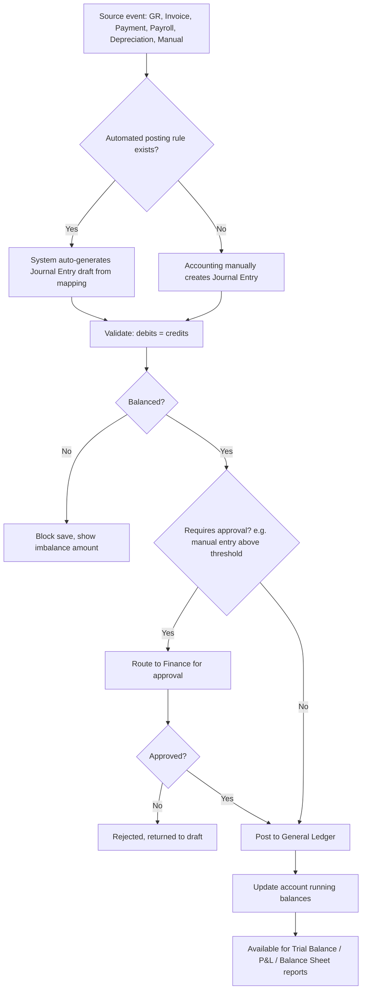

# 3. ERP Modules — Accounting Core (Chart of Accounts, General Ledger, Journal)

## Purpose

Provide the double-entry bookkeeping foundation that every financial
transaction across the ERP (Purchasing, Sales, Payroll, Fixed Assets,
Manufacturing variances) ultimately posts into, ensuring the books always
balance and every transaction is traceable to its source document.

## Business Process

1. Owner/Finance sets up the Chart of Accounts (COA) at company creation,
   either from an industry-specific starter template or custom-built.
2. Every subsequent module that has financial impact (GR/IR accrual, Sales
   Invoice, Payment, Payroll run, Depreciation run) generates a **Journal
   Entry** automatically via a posting rule mapped to that transaction type,
   OR Accounting staff creates manual Journal Entries directly for
   adjustments not covered by an automated flow.
3. Journal Entries are always balanced (total debits = total credits) before
   they can be posted; posting updates the General Ledger.
4. The General Ledger is the queryable, append-only record of all posted
   entries per account, used to generate all financial reports (Section 13).

## Workflow

## Functional Requirements

### Chart of Accounts

| ID | Requirement |
|---|---|
| COA-F1 | System supports hierarchical COA (Account Group → Account Category → Account), with standard top-level types: Asset, Liability, Equity, Revenue, Expense, Cost of Goods Sold. |
| COA-F2 | System ships industry-specific COA starter templates (Retail, Manufacturing, Services, Healthcare, Construction) selectable during onboarding, fully editable after. |
| COA-F3 | System supports account codes (configurable format, e.g. `1-1000`), account type, normal balance (debit/credit), and a flag `is_control_account` (e.g. AR/AP control accounts that are only postable via sub-ledger, not manual journal). |
| COA-F4 | System supports multi-currency accounts (an account can optionally be designated to track a specific foreign currency alongside base-currency equivalent). |
| COA-F5 | System supports account activation/deactivation (deactivated accounts cannot receive new postings but remain visible in historical reports). |

### General Ledger & Journal

| ID | Requirement |
|---|---|
| GL-F1 | System supports manual Journal Entry creation with multi-line debit/credit entries, each line referencing an account, optional cost-center/branch/project dimension, and a memo. |
| GL-F2 | System validates every Journal Entry balances (sum debits = sum credits) before allowing save-as-draft or post. |
| GL-F3 | System supports automated Journal Entry generation from a configurable posting-rule mapping table (`posting_rules`) per transaction type (e.g. `goods_receipt` → Dr Inventory / Cr GR-IR Clearing). |
| GL-F4 | System supports Journal Entry approval workflow for manual entries above a configurable value threshold; automated entries from validated source documents skip manual approval but are still auditable back to their source. |
| GL-F5 | System supports Journal Entry reversal (creates a new offsetting entry referencing the original, never edits/deletes a posted entry). |
| GL-F6 | System maintains a General Ledger view per account showing running balance, filterable by date range, branch, cost center. |
| GL-F7 | System supports Trial Balance generation (all accounts with debit/credit totals and balance) for any date range/period. |
| GL-F8 | System supports fiscal period locking (Finance can close a period, e.g. month-end); posting into a closed period is blocked unless explicitly reopened by Owner/Finance with audit note. |
| GL-F9 | System supports multi-currency journal lines with both transaction-currency and base-currency amounts, using the exchange rate effective at posting date (rate source configurable: manual entry or fetched rate table). |
| GL-F10 | System supports cost center / department / project dimensions on journal lines for management reporting beyond the base COA structure. |

## Business Rules

1. A Journal Entry can never be posted unbalanced — enforced at the database transaction level (insert of the JE header and all lines happens atomically; a trigger/application check rejects imbalance before commit).
2. Posted Journal Entries are immutable; the only way to "undo" one is a reversal entry, which is itself posted and auditable.
3. Control accounts (e.g. Accounts Receivable, Accounts Payable) cannot receive direct manual journal postings — they can only be affected via their respective sub-ledger modules (Invoice, Payment) to keep sub-ledger and GL in sync automatically.
4. Posting into a closed fiscal period is blocked; reopening a period requires Owner/Finance permission and creates an audit log entry, and reopening does not auto-close again — must be explicitly re-closed.
5. Every automated Journal Entry stores a reference (`source_type`, `source_id`) back to its originating document (GR, Invoice, Payment, etc.) — GL entries are never created "bare" without traceability.
6. Deleting an Account from the COA is blocked if any Journal Entry line references it, ever (even historically) — only deactivation is permitted.
7. Exchange rate used on a multi-currency journal line is locked at posting time; subsequent rate changes do not retroactively alter posted entries (revaluation, if needed, is a separate explicit Journal Entry).
8. The sum of all account balances where `normal_balance` rules are correctly applied must always satisfy Assets = Liabilities + Equity at any point in time; this is a continuously-verifiable invariant used as a system health check, not merely a report.

## Validation

| Field | Rules |
|---|---|
| `account.code` | Required, unique per company, matches company's configured code format. |
| `account.type` | Enum: `asset`, `liability`, `equity`, `revenue`, `expense`, `cogs`. |
| `journal_entry.lines[]` | Minimum 2 lines; each line must have either a debit OR credit amount (not both, not neither); sum(debits) must equal sum(credits). |
| `journal_entry.entry_date` | Required, must fall within an open fiscal period. |
| `posting_rules.mapping` | Must reference only active, non-control (unless system-managed) accounts. |

## Permissions

| Permission Key | Description |
|---|---|
| `accounting.coa.*` | CRUD Chart of Accounts (Finance/Owner). |
| `accounting.journal.create` | Create manual journal entries. |
| `accounting.journal.approve` | Approve journal entries above threshold. |
| `accounting.journal.reverse` | Reverse a posted entry. |
| `accounting.gl.view` | View General Ledger / Trial Balance. |
| `accounting.period.close` | Close/reopen fiscal periods. |
| `accounting.posting-rules.manage` | Configure automated posting rule mappings. |

## Acceptance Criteria

- Given a manual Journal Entry with debits totaling 5,000,000 and credits totaling 4,800,000, save-as-draft is allowed but "Post" is blocked with the exact imbalance (200,000) displayed.
- Given a Goods Receipt is posted with Accounting enabled, a corresponding Journal Entry is auto-created referencing `source_type=goods_receipt`, visible in the GL within the same request cycle.
- Given a fiscal period is closed, attempting to post any journal entry (manual or automated) dated within that period returns `422 PERIOD_CLOSED`.
- Given a posted Journal Entry is reversed, the original entry remains unchanged and a new entry with inverted debit/credit lines and a reference to the original is created and posted.
- Given an attempt to manually post directly to the Accounts Receivable control account, the API returns `422 CONTROL_ACCOUNT_DIRECT_POSTING_BLOCKED`.

## API Requirements

| Method | Endpoint | Description |
|---|---|---|
| GET/POST | `/api/accounting/chart-of-accounts` | List (tree) / create accounts. |
| GET/PUT/DELETE | `/api/accounting/chart-of-accounts/{id}` | View/update/deactivate account. |
| GET/POST | `/api/accounting/journal-entries` | List / create journal entries. |
| GET | `/api/accounting/journal-entries/{id}` | View entry detail with lines. |
| POST | `/api/accounting/journal-entries/{id}/post` | Post a draft entry. |
| POST | `/api/accounting/journal-entries/{id}/approve` | Approve pending entry. |
| POST | `/api/accounting/journal-entries/{id}/reverse` | Create reversal entry. |
| GET | `/api/accounting/general-ledger` | GL query, filterable by account/date/branch/cost-center. |
| GET | `/api/accounting/trial-balance` | Trial balance for a period. |
| GET/POST | `/api/accounting/posting-rules` | List / configure automated posting mappings. |
| POST | `/api/accounting/fiscal-periods/{id}/close` | Close a fiscal period. |
| POST | `/api/accounting/fiscal-periods/{id}/reopen` | Reopen with audit note. |

## UI Requirements

**Pages:** Chart of Accounts (Tree view + Table hybrid), Account
Create/Edit Drawer, Journal Entry List (filters: status/date/source), Journal
Entry Create/Edit (dynamic debit/credit line grid with running balance
indicator), Journal Entry Detail (with source-document link if automated),
General Ledger viewer (account picker → running-balance Table), Trial
Balance report screen, Posting Rules configuration Table, Fiscal Period
management screen.

**Components (FlyonUI):** Tree view (COA), Data Table with debit/credit
column pair, real-time balance-check Badge ("Balanced" green / "Out of
balance by X" red) on the JE line grid, Drawer, Modal (approve/reject/close
period confirmations), Tabs (JE Detail: Lines / Source Document / Audit),
Breadcrumb (GL drill-down from Trial Balance → Account → individual entries),
Chart (account balance trend), Skeleton loaders for GL queries on large
ranges.
