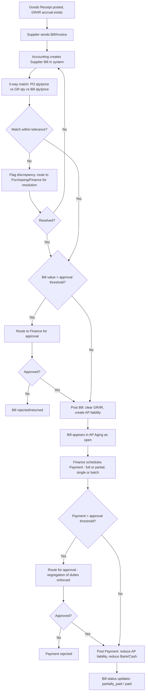

# 3. ERP Modules — Payment (Accounts Payable)

## Purpose

Manage supplier bills (AP invoices) and outgoing payments, keeping the
Accounts Payable sub-ledger in sync with the General Ledger, and giving
Finance visibility into cash outflow obligations. (The Accounts Receivable /
customer-payment side is specified in the Order-to-Cash phase's Invoice/
Payment module.)

## Business Process

1. Accounting records a Supplier Bill, typically generated by matching a
   Goods Receipt against the supplier's invoice document (3-way match: PO ×
   GR × Bill), or entered directly for non-PO expenses.
2. Bill amount, due date (from supplier payment terms), and tax are
   validated against the matched GR/PO where applicable.
3. Bill is approved (if above threshold) and posted, clearing the GR/IR
   accrual and creating an AP liability entry.
4. Payment is scheduled/made against one or more open Bills (full or
   partial), routed for approval per Finance's threshold, and posted,
   reducing the AP liability and cash/bank balance.
5. Payment Register and AP Aging reports give Finance forward visibility.

## Workflow

## Functional Requirements

| ID | Requirement |
|---|---|
| PAY-F1 | System supports Supplier Bill creation linked to one or more Goods Receipts (3-way match: PO, GR, Bill) or standalone (non-PO expense bills, e.g. utilities). |
| PAY-F2 | System performs automated 3-way match tolerance checking (quantity and price variance %, configurable, default 5%) and flags out-of-tolerance bills for manual resolution before posting. |
| PAY-F3 | System auto-calculates Bill due date from the supplier's configured payment terms, editable per bill with audit note. |
| PAY-F4 | System supports Bill approval workflow (value-threshold based, mirrors PO approval structure). |
| PAY-F5 | System supports partial payments against a single Bill and batch payments covering multiple Bills (single payment run to one supplier for several open bills). |
| PAY-F6 | System supports multiple payment methods: bank transfer, check/cheque, cash, virtual account — each generating the appropriate Journal Entry (crediting the correct Cash/Bank account). |
| PAY-F7 | System supports payment approval workflow with mandatory segregation of duties (the Bill creator/approver cannot also be the sole Payment approver for the same Bill). |
| PAY-F8 | System generates AP Aging report (current, 1-30, 31-60, 61-90, 90+ days overdue) per supplier and consolidated. |
| PAY-F9 | System supports Debit Notes (from Purchase Returns) that offset against future payments to the same supplier. |
| PAY-F10 | System supports early-payment discount terms (e.g. 2/10 Net 30) with automatic discount calculation if paid within the discount window. |
| PAY-F11 | System supports withholding tax (WHT) calculation on Bills where applicable, creating a separate WHT liability account entry. |

## Business Rules

1. A Bill cannot be posted if 3-way match variance exceeds the configured tolerance without an explicit override approval from Finance/Owner (with mandatory justification note).
2. A Payment cannot exceed the sum of open (unpaid) Bill balances being applied against — no overpayment without first creating a Supplier Credit/Advance record explicitly.
3. Segregation of duties: the same user cannot both create/approve a Bill above threshold AND approve its corresponding Payment — enforced at the application layer, configurable strictness (strict = different individuals; lenient = different roles suffices).
4. A Bill's due date, once a Payment has been recorded against it, cannot be edited (locked to prevent retroactive aging manipulation).
5. Debit Notes automatically reduce the "payable" queue for a supplier and must be applied (fully or partially) before or alongside a Payment to that supplier if unapplied Debit Notes exist and the company setting `auto_apply_debit_notes=true`.
6. Voiding a posted Payment is not permitted; corrections require a reversing Payment entry referencing the original.
7. Early-payment discounts are only auto-applied if payment is posted (not merely scheduled) within the discount window; scheduling alone does not lock in the discount.
8. Withholding tax entries are posted to a distinct liability account per tax type/rate, never commingled with the general AP control account, to support statutory WHT reporting.

## Validation

| Field | Rules |
|---|---|
| `supplier_bill.lines[].quantity` / `unit_price` | Required; must reconcile with matched GR within tolerance if PO-linked. |
| `supplier_bill.due_date` | Required, auto-derived but overridable; must be >= bill date. |
| `payment.amount` | Required, > 0, <= sum of applied Bill outstanding balances. |
| `payment.method` | Enum: `bank_transfer`, `check`, `cash`, `virtual_account`. |
| `payment.bank_account_id` | Required if method requires a source account; must belong to the company. |

## Permissions

| Permission Key | Description |
|---|---|
| `bill.create` / `.edit` / `.view` | Supplier Bill CRUD. |
| `bill.approve` | Approve bills above threshold. |
| `bill.match-override` | Override 3-way match tolerance failure. |
| `payment.create` | Create/schedule a payment. |
| `payment.approve` | Approve payment (segregation-of-duties enforced). |
| `payment.reverse` | Create a reversing payment entry. |
| `ap.aging.view` | View AP Aging report. |

## Acceptance Criteria

- Given a GR of 100 units @ 10,000 and a Bill of 100 units @ 10,600 (6% price variance, above 5% tolerance), posting is blocked pending Finance override.
- Given a supplier has 3 open bills totaling 15,000,000, a batch Payment of 15,000,000 marks all three `paid`; a Payment of 10,000,000 with allocation across bills marks bills `partially_paid`/`paid` per the allocation provided.
- Given the same user both approved a Bill above threshold and attempts to approve its Payment under strict segregation-of-duties mode, the API returns `403 SEGREGATION_OF_DUTIES_VIOLATION`.
- Given a Bill with terms "2/10 Net 30" is paid on day 8, the payment amount reflects the 2% discount automatically; paid on day 15, full amount is required.
- Given a posted Payment, `DELETE /api/payments/{id}` returns `409 PAYMENT_IMMUTABLE`; only `POST /api/payments/{id}/reverse` is permitted.

## API Requirements

| Method | Endpoint | Description |
|---|---|---|
| GET/POST | `/api/supplier-bills` | List / create bills (PO-linked or standalone). |
| GET/PUT | `/api/supplier-bills/{id}` | View/update bill (pre-approval only). |
| POST | `/api/supplier-bills/{id}/match` | Run/re-run 3-way match check. |
| POST | `/api/supplier-bills/{id}/approve` | Approve bill. |
| POST | `/api/supplier-bills/{id}/reject` | Reject bill. |
| GET/POST | `/api/payments` | List / create payments (single or batch allocation). |
| GET | `/api/payments/{id}` | View payment detail + allocations. |
| POST | `/api/payments/{id}/approve` | Approve payment. |
| POST | `/api/payments/{id}/reverse` | Create reversing payment. |
| GET | `/api/ap/aging` | AP Aging report, filterable by supplier/branch/date. |
| GET/POST | `/api/debit-notes` | List / create debit notes from returns. |
| POST | `/api/debit-notes/{id}/apply` | Apply debit note to a bill/payment. |

## UI Requirements

**Pages:** Supplier Bill List (filters: status/supplier/due date), Bill
Create (3-way match panel showing PO/GR/Bill side-by-side comparison), Bill
Detail, Bill Approval queue, Payment Create (Bill picker with allocation
table, running "remaining to allocate" indicator), Payment List/Detail,
Payment Approval queue, AP Aging report (Table + summary Chart), Debit Note
List/Detail.

**Components (FlyonUI):** Data Table, 3-way-match comparison Card (color-coded
variance highlighting: green within tolerance, red exceeds), Drawer/form for
Bill and Payment creation, allocation Table with live-updating remaining
balance, Badge (bill status: open/partially_paid/paid/overdue — overdue in
red), Chart (AP Aging bucket bar chart), Modal (approve/reject/override
confirmations), Toast, Tabs (Bill Detail: Lines / Match / Approval /
Payments Applied).
