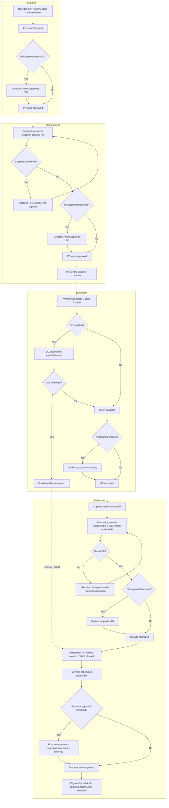

# 5. Complete Business Workflow — Procure to Pay

This is the end-to-end flow tying together every module delivered in Phase 2
(`07` through `11`). Individual module documents contain the detailed
per-module workflow; this view shows how they chain together and where
control/approval gates sit.

## Control Points Summary

| Gate | Enforced In | Rule Reference |
|---|---|---|
| PR approval threshold | Purchase Request module | PR-F2 |
| Blacklisted supplier block | Purchase Order module | PO Business Rule #1 |
| PO approval threshold + no self-approval | Purchase Order module | PO Business Rule #5 |
| Over-receipt tolerance | Goods Receipt module | GR-F3 |
| QC disposition gate | Goods Receipt module | GR-F5 |
| 3-way match tolerance | Payment (AP) module | PAY-F2, Business Rule #1 |
| Bill approval threshold | Payment (AP) module | PAY-F4 |
| Payment segregation of duties | Payment (AP) module | PAY-F7, Business Rule #3 |
| Fiscal period lock | Accounting Core module | GL-F8 |

Every gate above is independently configurable per company (thresholds,
tolerances, strict vs. lenient segregation-of-duties) via Settings, but the
*existence* of each gate in the flow is not optional — it can be set to a
zero threshold (effectively always-approve) but not removed from the
architecture, since downstream reporting (audit trail, AP aging, GL
integrity) assumes these checkpoints exist.
