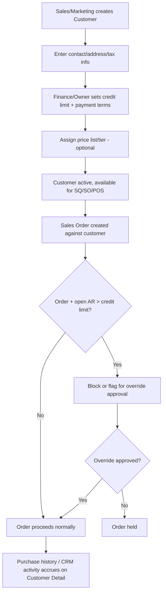

# 3. ERP Modules — Customer

## Purpose

Maintain customer master data, commercial terms (credit limit, payment
terms, price lists/discounts), and multi-address/contact structures that
Sales Quotation, Sales Order, Delivery Order, Invoice, CRM, and POS all
depend on.

## Business Process

1. Sales or Marketing creates a Customer record (individual or company),
   with billing/shipping addresses and contacts.
2. Owner/Finance sets commercial terms: credit limit, payment terms, price
   list/tier, and tax exemption status if applicable.
3. Customer status (`active`, `on_hold`, `blacklisted`) gates whether new
   Sales Orders can be raised.
4. Customer credit exposure (open Invoices + unfulfilled Sales Orders) is
   tracked live against the credit limit to block/flag over-limit orders.
5. Customer purchase history and CRM activity roll up on the Customer Detail
   page.

## Workflow

## Functional Requirements

| ID | Requirement |
|---|---|
| CUST-F1 | System supports full CRUD for Customer master data: individual or company type, billing/shipping addresses (multiple, one default each), contacts (multiple, role-tagged), tax ID. |
| CUST-F2 | System supports configurable credit limit per customer, with live exposure calculation = sum(open Invoices) + sum(unfulfilled/unbilled confirmed Sales Orders). |
| CUST-F3 | System supports configurable payment terms per customer (Net 15/30/60, COD, Prepaid), auto-calculating Invoice due dates. |
| CUST-F4 | System supports customer-specific or tier-based price lists and discount rules, applied automatically at Sales Quotation/Order line pricing. |
| CUST-F5 | System supports Customer status: `active`, `on_hold` (existing orders continue, no new orders), `blacklisted` (no new orders, flagged). |
| CUST-F6 | System supports customer segmentation/tagging for Marketing (industry, region, customer tier) independent of Sales pricing tiers. |
| CUST-F7 | System supports tax exemption flag with certificate attachment (relevant for reseller/wholesale/nonprofit customers). |
| CUST-F8 | System supports customer-assigned Sales Rep(s) for territory/account ownership and commission attribution. |
| CUST-F9 | System supports multi-currency customers (transaction currency independent of company base currency). |
| CUST-F10 | System supports a read-only rollup of purchase history (SQ/SO/Invoice/Payment counts and totals) and CRM activity timeline on the Customer Detail page. |

## Business Rules

1. A Customer cannot be deleted if any Sales Quotation, Sales Order, Delivery Order, or Invoice references it; only deactivation is allowed.
2. Setting a Customer to `blacklisted` blocks new Sales Quotations/Orders/POS transactions but does not affect already-open documents.
3. Credit limit exposure is recalculated on every Sales Order confirmation and every Invoice posting/payment — not on a batch schedule — so blocking decisions use current data.
4. A Sales Order that would push exposure over the credit limit is blocked by default; company setting `allow_credit_override` permits Sales Manager/Director override with mandatory justification note, logged.
5. Only one address per type (billing/shipping) can be `is_default=true`; setting a new default automatically unsets the previous one.
6. Tax exemption is only honored on Invoice tax calculation if a non-expired certificate attachment exists; an expired certificate reverts the customer to standard tax treatment automatically and flags a renewal reminder.
7. Tax ID uniqueness is validated per company (duplicate detection), not globally.
8. Price list/discount tier changes apply only to new documents going forward; already-issued Quotations/Orders retain their original pricing (no retroactive repricing).

## Validation

| Field | Rules |
|---|---|
| `name` | Required, max 255 chars. |
| `type` | Enum: `individual`, `company`. |
| `tax_id` | Optional, unique per company if present. |
| `credit_limit` | Numeric, >= 0 (0 = no credit allowed, cash-only). |
| `payment_terms_days` | Integer, >= 0. |
| `status` | Enum: `active`, `on_hold`, `blacklisted`. |
| `addresses[].type` | Enum: `billing`, `shipping`. |

## Permissions

| Permission Key | Description |
|---|---|
| `customer.view` (scoped) | View customer list/detail — scoped to own accounts/team for Sales role unless "all accounts" granted. |
| `customer.create` / `.edit` | Create/edit customer master data. |
| `customer.delete` | Deactivate a customer. |
| `customer.credit.override` | Override credit limit block on an order. |
| `customer.credit.configure` | Set/change credit limit and payment terms. |
| `customer.segment.edit` | Marketing segmentation/tagging. |
| `customer.price-list.manage` | Manage customer-specific pricing. |

## Acceptance Criteria

- Given a customer with a 50,000,000 credit limit and 45,000,000 in open AR + unfulfilled orders, a new order of 6,000,000 is blocked (would total 51,000,000) unless overridden.
- Given a `blacklisted` customer, attempting `POST /api/sales-orders` with that `customer_id` returns `422 CUSTOMER_BLACKLISTED`.
- Given a customer's tax exemption certificate expired yesterday, an Invoice created today calculates standard tax, not exempt, and a renewal reminder notification is queued.
- Given a customer referenced by any Invoice, `DELETE /api/customers/{id}` returns `409 CUSTOMER_IN_USE`.
- Given a Sales role scoped to "own accounts only," GET `/api/customers` excludes customers assigned to other Sales reps.

## API Requirements

| Method | Endpoint | Description |
|---|---|---|
| GET/POST | `/api/customers` | List (filter by status/tag/rep) / create. |
| GET/PUT/DELETE | `/api/customers/{id}` | View/update/deactivate. |
| POST | `/api/customers/import` | Bulk import CSV/XLSX. |
| GET | `/api/customers/export` | Bulk export. |
| GET/POST | `/api/customers/{id}/addresses` | Manage addresses. |
| GET/POST | `/api/customers/{id}/contacts` | Manage contacts. |
| GET | `/api/customers/{id}/credit-exposure` | Live credit exposure calculation. |
| GET/POST | `/api/customers/{id}/price-list` | Manage customer-specific pricing. |
| GET | `/api/customers/{id}/purchase-history` | Rollup of SQ/SO/Invoice/Payment history. |
| PUT | `/api/customers/{id}/status` | Change status with reason note. |

## UI Requirements

**Pages:** Customer List (Table, filters: status/tag/rep/segment), Customer
Detail (Tabs: General, Addresses, Contacts, Credit & Terms, Price List,
Purchase History, CRM Activity, Documents), Customer Create/Edit Drawer.

**Components (FlyonUI):** Data Table, Tabs, Badge (status color-coded), Chart
(credit exposure gauge — used vs. limit), Timeline (purchase history + CRM
activity combined feed), Drawer (create/edit), Modal (credit override
confirmation with justification textarea), Toast, Empty State ("No customers
yet").
