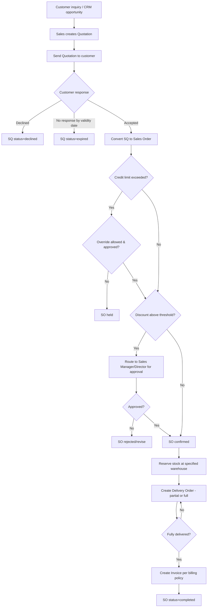

# 3. ERP Modules — Sales Quotation & Sales Order

## Purpose

Capture customer demand as a formal, priced offer (Sales Quotation) and
convert accepted offers into a binding commitment to fulfil (Sales Order),
which drives Delivery Order, Invoice, and inventory reservation.

## Business Process — Sales Quotation (SQ)

1. Sales creates a Quotation for a Customer with line items, pricing
   (defaulted from customer/tier price list, editable within discount
   limits), validity period, and delivery estimate.
2. Quotation is sent to the customer (PDF/email); status tracked
   (`draft` → `sent` → `accepted`/`declined`/`expired`).
3. Accepted Quotations convert (fully or partially) into a Sales Order.

## Business Process — Sales Order (SO)

1. SO created from an accepted SQ or directly (ad-hoc).
2. Credit limit check runs against the customer (see Customer module).
3. SO confirmation reserves stock (`quantity_reserved`) for stockable
   products at the specified warehouse.
4. SO drives Delivery Order creation (partial or full) and, upon
   delivery/billing milestone per company policy, Invoice creation.
5. SO status: `draft` → `pending_approval` (if discount/credit override
   needed) → `confirmed` → `partially_delivered`/`partially_invoiced` →
   `completed` / `cancelled`.

## Workflow

## Functional Requirements — Sales Quotation

| ID | Requirement |
|---|---|
| SQ-F1 | System supports SQ creation with multi-line items, quantity, unit, price (defaulted from customer price list/tier), line discount, and validity period (default 14 days, configurable). |
| SQ-F2 | System supports SQ status lifecycle: `draft` → `sent` → `accepted` / `declined` / `expired` (auto-expired via scheduler past validity date). |
| SQ-F3 | System generates a printable/emailable SQ document (PDF) with company branding. |
| SQ-F4 | System supports SQ revision (new version) prior to acceptance, maintaining version history. |
| SQ-F5 | System supports converting an accepted SQ into a Sales Order (fully or selecting a subset of lines). |
| SQ-F6 | System supports SQ line-level discount up to a configurable % without approval; above that, requires Sales Manager approval even at SQ stage (early warning before SO commitment). |

## Functional Requirements — Sales Order

| ID | Requirement |
|---|---|
| SO-F1 | System supports SO creation from one or more accepted SQs, or ad-hoc (direct) per company policy toggle. |
| SO-F2 | System runs live credit-limit exposure check on SO confirmation (see Customer module CUST-F2/F3/Business Rule #4). |
| SO-F3 | System supports SO approval workflow for discount-above-threshold or credit-override cases. |
| SO-F4 | System reserves stock (`quantity_reserved`) per line at SO confirmation for stockable products; service/non-stock lines skip reservation. |
| SO-F5 | System supports partial fulfillment: multiple Delivery Orders against one SO until fully delivered. |
| SO-F6 | System supports configurable billing policy per company/customer: `bill_on_order` (invoice at confirmation), `bill_on_delivery` (invoice per DO), `bill_on_milestone` (project-based, manual trigger). |
| SO-F7 | System supports SO cancellation (full or line-level) prior to delivery; partial cancellation after partial delivery closes only the un-delivered remainder and releases its stock reservation. |
| SO-F8 | System supports multi-currency SOs with locked exchange rate at confirmation. |
| SO-F9 | System generates a printable/emailable SO confirmation document. |
| SO-F10 | System supports recurring Sales Orders (subscription-style, auto-generating a new SO on a schedule) as an advanced/optional feature. |

## Business Rules

1. An SQ cannot be converted to SO if its validity date has passed (must be revised/re-sent first).
2. SO confirmation is blocked if the resulting customer credit exposure exceeds their limit, unless overridden (see Customer Business Rule #4) — the block happens at confirmation, not at draft creation, so Sales can still build/negotiate a draft freely.
3. Stock reservation at SO confirmation reduces `quantity_available` company-wide for that warehouse but does not move physical stock; if insufficient stock exists to reserve, the SO can still be confirmed (backorder) with the shortfall flagged, unless company setting `block_so_on_insufficient_stock=true`.
4. Cancelling an SO line after partial delivery only cancels the undelivered quantity; already-delivered/invoiced quantity is unaffected and cannot be retroactively removed via SO cancellation (a Sales Return process, delivered later, handles that).
5. Segregation of duties: the Sales rep who created an SO requiring discount/credit approval cannot self-approve, mirroring the PO rule.
6. Exchange rate is locked at SO confirmation time for multi-currency orders; later rate changes do not retroactively alter the SO, Delivery Order, or Invoice values derived from it.
7. An SO cannot be deleted once confirmed; only cancellation (which preserves the record for audit) is permitted.
8. Price list changes for a customer apply only to new SQs/SOs created after the change — never retroactively to open documents.

## Validation

| Field | Rules |
|---|---|
| `sales_quotation.validity_date` | Required, must be >= quotation date. |
| `sales_quotation.lines[].unit_price` | Required, >= 0. |
| `sales_order.customer_id` | Required, customer must be `active`. |
| `sales_order.lines[].warehouse_id` | Required for stockable products, must be active and accessible to the selling branch. |
| `sales_order.currency` | Required, ISO 4217; exchange rate required if != company base currency. |

## Permissions

| Permission Key | Description |
|---|---|
| `sales-quotation.create` / `.edit` / `.view` | SQ CRUD. |
| `sales-quotation.send` | Send SQ to customer. |
| `sales-order.create` / `.edit` / `.view` (scoped) | SO CRUD, scoped to own accounts for Sales role unless "all" granted. |
| `sales-order.approve` | Approve SO above discount/credit threshold (excludes self-approval). |
| `sales-order.cancel` | Cancel SO/lines. |
| `sales-order.credit-override` | Override credit block. |

## Acceptance Criteria

- Given an SQ with validity date of yesterday, attempting `POST /api/sales-quotations/{id}/convert-to-so` returns `422 QUOTATION_EXPIRED`.
- Given a customer at 90% of credit limit, confirming an SO that would push exposure to 105% is blocked with `422 CREDIT_LIMIT_EXCEEDED` unless an approved override exists.
- Given `block_so_on_insufficient_stock=false` (default), confirming an SO for a product with 0 available stock succeeds but the SO line is flagged `backorder=true`.
- Given an SO with 3 lines, 1 fully delivered and 2 pending, cancelling the SO cancels only the 2 pending lines and releases their stock reservation; the delivered line remains on record.
- Given a Sales rep creates an SO requiring their own approval (discount above threshold), the API returns `403 SELF_APPROVAL_BLOCKED` when they attempt to approve it themselves.

## API Requirements

| Method | Endpoint | Description |
|---|---|---|
| GET/POST | `/api/sales-quotations` | List / create SQ. |
| GET/PUT/DELETE | `/api/sales-quotations/{id}` | View/update/cancel SQ. |
| POST | `/api/sales-quotations/{id}/send` | Send to customer (PDF/email). |
| POST | `/api/sales-quotations/{id}/accept` | Record customer acceptance. |
| POST | `/api/sales-quotations/{id}/decline` | Record customer decline. |
| POST | `/api/sales-quotations/{id}/convert-to-so` | Convert (all/partial lines) to SO. |
| GET/POST | `/api/sales-orders` | List / create SO. |
| GET/PUT | `/api/sales-orders/{id}` | View/update SO (pre-confirmation only). |
| POST | `/api/sales-orders/{id}/confirm` | Confirm SO (runs credit check, reserves stock). |
| POST | `/api/sales-orders/{id}/approve` | Approve pending SO. |
| POST | `/api/sales-orders/{id}/reject` | Reject SO. |
| POST | `/api/sales-orders/{id}/cancel` | Cancel SO or specific lines. |
| GET | `/api/sales-orders/{id}/pdf` | Generate SO confirmation document. |
| GET | `/api/sales-orders/{id}/fulfillment-status` | Delivery/invoice progress per line. |

## UI Requirements

**Pages:** SQ List (Table, filters: status/customer/rep), SQ Create/Edit
(line-item grid with price-list autocomplete), SQ Detail, SO List (Table,
filters: status/customer/branch), SO Create/Edit, SO Detail (Tabs: Lines,
Fulfillment Progress, Approval History, Deliveries, Invoices, Documents), SO
Approval queue.

**Components (FlyonUI):** Data Table with status Badge chips, dynamic
line-item Table (add/remove rows, live subtotal/discount/tax calculation),
Autocomplete for product/customer selection, progress bar/Badge for
fulfillment status (e.g. "60% delivered"), Timeline (approval chain, and
separately SQ→SO→DO→Invoice document chain), Modal (approve/reject/credit
override), Toast, Print/PDF preview Modal, Tabs (SO Detail).
