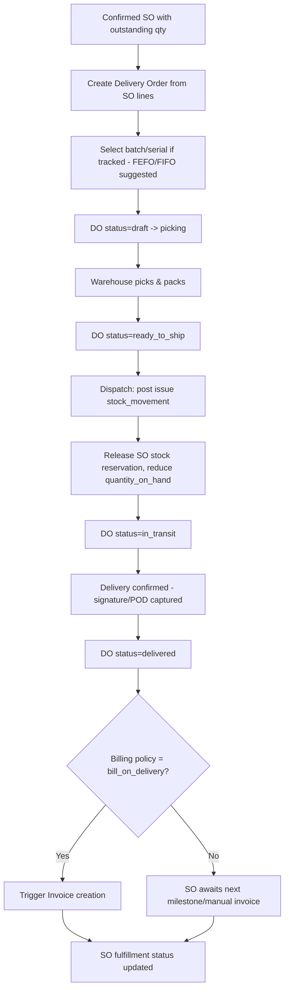

# 3. ERP Modules — Delivery Order

## Purpose

Record the physical shipment of goods to a customer against a confirmed
Sales Order, converting reserved stock into actually-shipped stock and
providing proof-of-delivery documentation.

## Business Process

1. Warehouse (or Sales, depending on company setup) creates a Delivery Order
   from an SO's outstanding lines, specifying shipped quantity per line
   (may be less than ordered — partial delivery).
2. Batch/serial-tracked products require batch/serial selection at delivery
   (typically FEFO/FIFO-suggested, overridable).
3. DO is picked, packed, and dispatched (status lifecycle); on dispatch, an
   `issue` stock movement posts and the SO reservation for that quantity is
   released and converted to an actual decrease in `quantity_on_hand`.
4. Proof of delivery (signature/photo, future mobile-app capture point) is
   recorded on confirmed delivery.
5. DO feeds Invoice creation per the company's billing policy.

## Workflow

## Functional Requirements

| ID | Requirement |
|---|---|
| DO-F1 | System supports creating a DO from one or more open SO lines (single SO per DO, or consolidated multi-SO delivery to the same customer/address per company setting). |
| DO-F2 | System supports partial delivery (shipped qty < ordered qty), leaving remaining qty open on the SO for future DOs. |
| DO-F3 | System supports DO status lifecycle: `draft` → `picking` → `ready_to_ship` → `in_transit` → `delivered` / `cancelled` / `failed_delivery`. |
| DO-F4 | System captures batch/serial at the line level when required, with FEFO (expiry-tracked) or FIFO (cost-layer) suggested allocation, overridable by the picker. |
| DO-F5 | System supports proof-of-delivery capture: recipient name, signature (image), delivery photo, timestamp, GPS coordinates (optional, mobile-app-ready field even if v1 web UI only supports manual entry). |
| DO-F6 | System supports delivery failure recording (`failed_delivery` status) with reason code, returning reserved stock to available (not yet re-issued) state for redelivery scheduling. |
| DO-F7 | System generates a printable/emailable DO / packing slip / delivery note document. |
| DO-F8 | System supports carrier/shipping method reference field (informational, not a live carrier API integration in v1) and tracking number field. |
| DO-F9 | System supports pick-list generation grouped by warehouse zone/bin location for efficient picking (depends on warehouse layout data being configured; degrades gracefully to a flat list if not). |

## Business Rules

1. A DO cannot ship more than the SO line's outstanding (ordered minus already-delivered) quantity.
2. Dispatching a DO (status → `in_transit`) is the trigger point that converts reserved stock into an actual `issue` stock movement — draft/picking-status DOs do not move physical inventory, only reflect the existing SO-level reservation.
3. Batch/serial selection at delivery must respect FEFO/FIFO suggestion unless the picker has `inventory.allocation.override` permission, in which case an override reason is required and logged.
4. A `failed_delivery` DO returns its quantity to `quantity_reserved` (not `quantity_available`) since the SO commitment still stands, pending redelivery; it does not silently re-enter general available stock.
5. Once `delivered`, a DO is immutable (append-only); corrections go through a Sales Return process (delivered in a later phase) or a company-approved DO reversal/void with mandatory reason, which reverses the stock movement.
6. A DO cannot be created against a cancelled SO or a cancelled SO line.
7. Consolidating multiple SOs into one DO is only permitted if all consolidated SOs share the same customer and delivery address.

## Validation

| Field | Rules |
|---|---|
| `delivery_order.lines[].shipped_quantity` | Required, > 0, <= SO line outstanding qty. |
| `delivery_order.lines[].batch_number` / `serial_number` | Required if product tracking flags require it. |
| `delivery_order.delivery_address` | Required, defaults from customer's default shipping address, editable per DO. |
| `delivery_order.pod.recipient_name` | Required to transition to `delivered` status. |

## Permissions

| Permission Key | Description |
|---|---|
| `delivery-order.create` / `.view` | DO CRUD (Warehouse/Sales role). |
| `delivery-order.dispatch` | Transition to `in_transit` (posts stock movement). |
| `delivery-order.confirm-delivery` | Record POD, transition to `delivered`. |
| `delivery-order.cancel` | Cancel a DO prior to dispatch. |
| `delivery-order.void` | Void a delivered DO with reversal (Owner/Warehouse Manager only). |
| `inventory.allocation.override` | Override FEFO/FIFO suggested batch/serial allocation. |

## Acceptance Criteria

- Given an SO line for 100 units, a DO for 60 units leaves 40 units outstanding on the SO; a second DO for 40 completes fulfillment for that line.
- Given a DO is dispatched, a corresponding `issue` stock movement is posted and `quantity_on_hand` decreases by the shipped quantity at the source warehouse.
- Given a DO fails delivery, its quantity returns to `quantity_reserved` (visible in customer's SO as still-committed) not to general `quantity_available`.
- Given an expiry-tracked product with two batches (Batch A expires sooner than Batch B), the DO defaults to allocating from Batch A first; overriding to Batch B requires the override permission and logs a reason.
- Given a delivered DO, attempting `PUT /api/delivery-orders/{id}` returns `409 DOCUMENT_IMMUTABLE`.

## API Requirements

| Method | Endpoint | Description |
|---|---|---|
| GET/POST | `/api/delivery-orders` | List / create DO. |
| GET/PUT | `/api/delivery-orders/{id}` | View/update DO (pre-dispatch only). |
| POST | `/api/delivery-orders/{id}/dispatch` | Dispatch (posts stock movement). |
| POST | `/api/delivery-orders/{id}/confirm-delivery` | Record POD, mark delivered. |
| POST | `/api/delivery-orders/{id}/fail` | Record failed delivery with reason. |
| POST | `/api/delivery-orders/{id}/cancel` | Cancel pre-dispatch DO. |
| POST | `/api/delivery-orders/{id}/void` | Void a delivered DO (reversal). |
| GET | `/api/delivery-orders/{id}/pdf` | Printable delivery note/packing slip. |
| GET | `/api/delivery-orders/{id}/pick-list` | Pick-list grouped by zone/bin. |

## UI Requirements

**Pages:** DO List (Table, filters: status/customer/SO), DO Create (SO
picker → line entry grid with batch/serial and FEFO/FIFO suggestion), DO
Detail (Tabs: Lines, Proof of Delivery, Status History, Documents), Pick
List view (tablet-optimized, zone-grouped), Delivery confirmation screen
(signature capture, recipient name, photo upload).

**Components (FlyonUI):** Data Table with status Badge (color-coded per
lifecycle stage), Drawer/multi-step form for DO creation, batch/serial
picker with suggested-allocation highlighting (green = suggested, amber =
override), Modal (delivery failure reason capture), signature-pad component
for POD, Timeline (DO status history), Toast, Print preview Modal.
