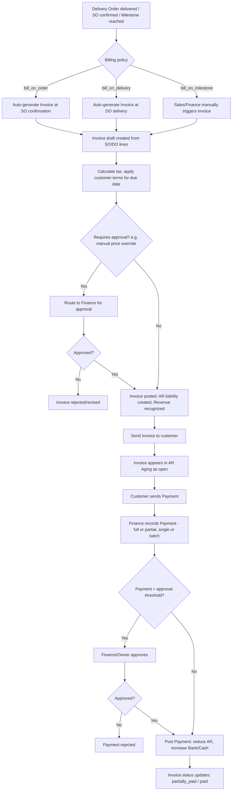

# 3. ERP Modules — Invoice & Payment (Accounts Receivable)

## Purpose

Bill customers for delivered goods/services per the company's billing
policy, track Accounts Receivable, and record incoming customer payments,
keeping the AR sub-ledger synced with the General Ledger (mirrors the AP
module's structure from Phase 2, on the receivable side).

## Business Process

1. Invoice is generated per the SO's billing policy (`bill_on_order`,
   `bill_on_delivery`, `bill_on_milestone`) — automatically for the first
   two, manually triggered for milestone billing.
2. Invoice amount, due date (from customer payment terms), and tax are
   calculated from the source SO/DO lines.
3. Invoice is sent to the customer (PDF/email); status tracked
   (`draft` → `sent` → `partially_paid` → `paid` / `overdue` / `void`).
4. Customer Payment is recorded against one or more open Invoices (full or
   partial), reducing AR and increasing Bank/Cash.
5. AR Aging report gives Sales/Finance visibility into overdue receivables.

## Workflow

## Functional Requirements

| ID | Requirement |
|---|---|
| INV-AR-F1 | System supports auto-generation of Invoices from SO/DO per the configured billing policy, and manual Invoice creation for milestone billing or non-SO ad-hoc billing. |
| INV-AR-F2 | System auto-calculates tax per line based on product tax category and customer tax-exemption status. |
| INV-AR-F3 | System auto-calculates Invoice due date from the customer's configured payment terms, editable per invoice with audit note. |
| INV-AR-F4 | System supports Invoice approval workflow for manually price-overridden or above-threshold invoices. |
| INV-AR-F5 | System supports partial payments against a single Invoice and batch payments covering multiple Invoices from the same customer. |
| INV-AR-F6 | System supports multiple payment methods: bank transfer, check/cheque, cash, card, virtual account/QR — each generating the appropriate Journal Entry. |
| INV-AR-F7 | System generates AR Aging report (current, 1-30, 31-60, 61-90, 90+ days overdue) per customer and consolidated. |
| INV-AR-F8 | System supports Credit Notes (from Sales Returns, future module) that offset against future invoices/payments for the same customer. |
| INV-AR-F9 | System supports Invoice void (pre-payment only) and Invoice cancellation reasons logged for audit. |
| INV-AR-F10 | System supports recurring/subscription invoicing for retainer-based services (advanced/optional feature). |
| INV-AR-F11 | System supports partial credit-note application at invoice creation time (customer advance/deposit offsetting the invoice total). |
| INV-AR-F12 | System supports multi-currency invoices with exchange rate locked at posting, consistent with the originating SO's locked rate. |

## Business Rules

1. An Invoice's line quantities/prices must reconcile to their source DO/SO lines unless explicitly manually overridden with a justification note (auditable).
2. A customer Payment cannot exceed the sum of open Invoice balances being applied against — overpayment requires first creating a Customer Advance/Credit record explicitly, never a negative-balance invoice.
3. An Invoice's due date, once a Payment has been recorded against it, cannot be edited (locked, mirrors AP Bill rule).
4. Voiding a posted Invoice is only permitted before any Payment exists against it; once any payment (even partial) is recorded, correction requires a Credit Note, not a void.
5. Credit Notes automatically reduce the "receivable" queue for a customer and are auto-applied to the oldest open Invoice first if company setting `auto_apply_credit_notes_fifo=true`, otherwise held for manual application.
6. Voiding a posted Payment is not permitted; corrections require a reversing Payment entry referencing the original (mirrors AP rule).
7. Revenue recognition timing (at invoice posting vs. at delivery vs. deferred/milestone) is configurable per company/product-category via the posting-rules mapping (see Accounting Core module), but the Invoice module always posts AR + Revenue (or Deferred Revenue) atomically — never AR without a corresponding revenue-side entry.
8. Overdue status (`overdue`) is a computed/derived state (due date passed with balance > 0), recalculated on read, not a manually settable status.

## Validation

| Field | Rules |
|---|---|
| `invoice.lines[].quantity` / `unit_price` | Required; must reconcile with source DO/SO within tolerance if linked, else requires override note. |
| `invoice.due_date` | Required, auto-derived but overridable; must be >= invoice date. |
| `payment.amount` | Required, > 0, <= sum of applied Invoice outstanding balances. |
| `payment.method` | Enum: `bank_transfer`, `check`, `cash`, `card`, `virtual_account`. |

## Permissions

| Permission Key | Description |
|---|---|
| `invoice.create` / `.edit` / `.view` (scoped) | Invoice CRUD, scoped to own accounts for Sales role (view only, no edit) vs. full for Accounting. |
| `invoice.approve` | Approve invoices above threshold/override. |
| `invoice.void` | Void a pre-payment invoice. |
| `payment.create` (AR) | Record a customer payment. |
| `payment.approve` (AR) | Approve payment above threshold. |
| `ar.aging.view` | View AR Aging report. |
| `credit-note.manage` | Create/apply Credit Notes. |

## Acceptance Criteria

- Given `bill_on_delivery` policy and a DO transitions to `delivered`, an Invoice draft is auto-created referencing that DO's lines within the same request cycle.
- Given a customer has 3 open invoices totaling 20,000,000, a Payment of 20,000,000 marks all three `paid`; a Payment of 12,000,000 with explicit allocation marks bills `partially_paid`/`paid` per the allocation.
- Given an Invoice has a partial Payment recorded, attempting `POST /api/invoices/{id}/void` returns `422 INVOICE_HAS_PAYMENTS`; a Credit Note must be used instead.
- Given an Invoice due date has passed and balance remains > 0, `GET /api/invoices/{id}` returns computed `status=overdue` without any stored status field having been manually changed.
- Given a posted Payment, `DELETE /api/payments/{id}` returns `409 PAYMENT_IMMUTABLE`; only `POST /api/payments/{id}/reverse` is permitted.

## API Requirements

| Method | Endpoint | Description |
|---|---|---|
| GET/POST | `/api/invoices` | List / create invoices (SO/DO-linked or standalone). |
| GET/PUT | `/api/invoices/{id}` | View/update invoice (pre-approval/pre-send only). |
| POST | `/api/invoices/{id}/approve` | Approve invoice. |
| POST | `/api/invoices/{id}/send` | Send to customer (PDF/email). |
| POST | `/api/invoices/{id}/void` | Void a pre-payment invoice. |
| GET | `/api/invoices/{id}/pdf` | Generate invoice document. |
| GET/POST | `/api/ar-payments` | List / create customer payments (single or batch allocation). |
| GET | `/api/ar-payments/{id}` | View payment detail + allocations. |
| POST | `/api/ar-payments/{id}/approve` | Approve payment. |
| POST | `/api/ar-payments/{id}/reverse` | Create reversing payment. |
| GET | `/api/ar/aging` | AR Aging report, filterable by customer/branch/date. |
| GET/POST | `/api/credit-notes` | List / create credit notes. |
| POST | `/api/credit-notes/{id}/apply` | Apply credit note to an invoice/payment. |

## UI Requirements

**Pages:** Invoice List (filters: status/customer/due date/overdue),
Invoice Create (SO/DO picker or manual line entry), Invoice Detail, Invoice
Approval queue, AR Payment Create (Invoice picker with allocation table),
AR Payment List/Detail, AR Payment Approval queue, AR Aging report (Table +
summary Chart), Credit Note List/Detail.

**Components (FlyonUI):** Data Table, allocation Table with live-updating
remaining balance, Badge (invoice status: open/partially_paid/paid/overdue —
overdue in red with day-count), Chart (AR Aging bucket bar chart, DSO trend),
Drawer/form for Invoice and Payment creation, Modal
(approve/reject/void/reverse confirmations), Toast, Tabs (Invoice Detail:
Lines / Source Documents / Approval / Payments Applied / Credit Notes).
