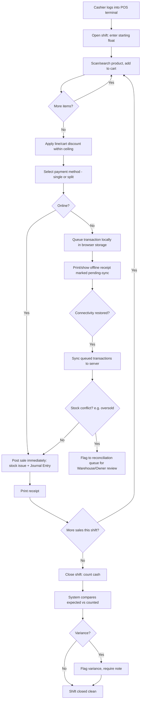

# 3. ERP Modules — POS (Point of Sale)

## Purpose

Provide a fast, offline-capable, kiosk-style transaction interface for
Cashier-role users to sell products directly to walk-in customers, reconcile
cash drawers per shift, and post the resulting stock and financial impact
into the same core Inventory/Accounting/Customer data used everywhere else
in the ERP.

## Business Process

1. Cashier logs into a POS terminal/register (device-bound session, tied to
   a specific Warehouse and Branch).
2. Cashier opens a shift, entering starting cash float.
3. Cashier scans/searches products, applies quantity, optional line
   discount (within configured ceiling), selects payment method(s) — supports
   split payment (e.g. partial cash + partial card).
4. On checkout, system posts an `issue` stock movement immediately (POS
   sales bypass the SO/DO flow — direct sale), creates a lightweight
   "POS Sale" transaction record, and (if Accounting enabled) posts revenue
   + tax + payment-method Journal Entries.
5. Cashier can process returns/refunds within POS policy limits (time
   window, receipt required); above-limit refunds require Supervisor PIN
   override.
6. Cashier closes shift: system reconciles expected vs. counted cash,
   flags variance.
7. If offline (network loss), transactions queue locally and sync when
   connectivity returns; conflicts (e.g. stock oversold across two offline
   terminals) are flagged into a reconciliation queue.

## Workflow

## Functional Requirements

| ID | Requirement |
|---|---|
| POS-F1 | System supports a locked-down, kiosk-style POS UI distinct from the back-office UI, optimized for touch/barcode-scanner input. |
| POS-F2 | System supports Shift management: open (starting float), running transaction log, close (cash count + variance reconciliation), tied to a specific Cashier + Terminal + Warehouse. |
| POS-F3 | System supports barcode scan-to-add, product search, quantity adjustment, and cart-level or line-level discounts within a configured ceiling (above which requires Supervisor PIN). |
| POS-F4 | System supports split/multiple payment methods per transaction (e.g. 50% cash + 50% card), each tracked separately for reconciliation. |
| POS-F5 | System posts stock `issue` movements directly at sale completion (no SO/DO intermediary), referencing `reference_type=pos_sale`. |
| POS-F6 | System supports POS returns/refunds within a configurable time window and receipt-verification requirement; above-ceiling refunds require Supervisor PIN override. |
| POS-F7 | System supports offline mode: transactions queue in local browser storage (IndexedDB, not localStorage per platform constraints) when connectivity is lost, syncing automatically on reconnect. |
| POS-F8 | System flags sync conflicts (e.g. stock oversold across concurrently-offline terminals) into a reconciliation queue for Warehouse Manager/Owner review rather than silently failing or silently allowing negative stock. |
| POS-F9 | System generates a printable/emailable receipt per transaction, and an end-of-shift summary report (sales by payment method, discounts given, refunds, variance). |
| POS-F10 | System supports quick customer lookup/attach to a POS sale (optional — walk-in sales can remain anonymous) for loyalty/CRM tracking. |
| POS-F11 | System supports register/terminal-level configuration: default warehouse, receipt printer settings (client-side), allowed payment methods, discount ceiling, refund ceiling. |

## Business Rules

1. A POS terminal session is bound to exactly one open Shift at a time; a Cashier cannot process a sale without an open shift.
2. Cash variance at shift close beyond a configurable tolerance (default: any variance) requires a mandatory note; beyond a larger threshold (configurable) requires Supervisor/Owner acknowledgment before the shift can be marked closed.
3. Offline-queued transactions retain their original client-side timestamp for sequencing, but their `posted_at` (server) timestamp reflects actual sync time — both are stored for audit clarity.
4. If an offline sync would oversell stock (insufficient quantity available by the time of sync), the transaction is NOT silently rejected or force-negative-posted; it is completed as a sale (customer already has the goods) but flagged with `stock_conflict=true` for Warehouse/Owner reconciliation, since refusing a sale that already physically happened isn't meaningful.
5. Refunds always reference the original POS Sale transaction; a refund cannot exceed the original sale's paid amount per line.
6. Supervisor PIN overrides (for discount ceiling, refund ceiling) are themselves audit-logged with the overriding supervisor's identity, not just a boolean flag.
7. POS sales with Accounting enabled post revenue/tax/payment Journal Entries synchronously on sale completion (online) or in the sync batch (offline), never deferred to a manual reconciliation step, to keep GL current.
8. A closed shift cannot have new transactions posted against it; a cashier must open a new shift.

## Validation

| Field | Rules |
|---|---|
| `shift.starting_float` | Required, >= 0. |
| `pos_sale.lines[].quantity` | Required, > 0. |
| `pos_sale.payments[].amount` | Sum of all payment lines must equal cart total (within rounding tolerance). |
| `pos_sale.discount_percent` | <= terminal-configured ceiling unless Supervisor PIN override recorded. |
| `refund.amount` | <= original sale's paid amount for the referenced line(s). |

## Permissions

| Permission Key | Description |
|---|---|
| `pos.shift.open` / `.close` | Shift lifecycle (Cashier, shift-scoped). |
| `pos.transaction.create` | Process a sale. |
| `pos.transaction.refund` | Process a refund within ceiling. |
| `pos.override.discount` | Supervisor PIN override for discount ceiling. |
| `pos.override.refund` | Supervisor PIN override for refund ceiling. |
| `pos.reconciliation.review` | Review/resolve sync conflict queue (Warehouse Manager/Owner). |
| `pos.terminal.configure` | Configure terminal/register settings. |

## Acceptance Criteria

- Given no open shift, attempting a POS sale returns `422 NO_OPEN_SHIFT` and prompts shift-open flow.
- Given a cart discount of 15% and a terminal ceiling of 10%, checkout is blocked pending Supervisor PIN entry; entering a valid PIN records the override with the supervisor's user ID and proceeds.
- Given the POS goes offline mid-shift, 5 sales are queued locally; on reconnect, all 5 sync in original sequence order, each retaining its original client timestamp alongside the new server `posted_at`.
- Given an offline sync detects insufficient stock for one queued sale, that sale still completes (goods already left the store) but is flagged `stock_conflict=true` and appears in the Warehouse reconciliation queue.
- Given a shift closes with counted cash 50,000 less than expected (above the configured tolerance), the close action is blocked until a Supervisor acknowledgment is recorded alongside the cashier's variance note.

## API Requirements

| Method | Endpoint | Description |
|---|---|---|
| POST | `/api/pos/shifts/open` | Open a shift with starting float. |
| POST | `/api/pos/shifts/{id}/close` | Close shift with counted cash. |
| GET | `/api/pos/shifts/{id}` | Shift summary (sales, refunds, variance). |
| GET | `/api/pos/products/search` | Fast product search/barcode lookup, warehouse-scoped. |
| POST | `/api/pos/sales` | Process a sale transaction. |
| POST | `/api/pos/sales/sync-batch` | Sync a batch of offline-queued transactions. |
| POST | `/api/pos/sales/{id}/refund` | Process a refund against a sale. |
| POST | `/api/pos/override` | Validate Supervisor PIN, log override. |
| GET | `/api/pos/reconciliation-queue` | List flagged sync conflicts. |
| POST | `/api/pos/reconciliation-queue/{id}/resolve` | Resolve a flagged conflict. |
| GET | `/api/pos/terminals/{id}/config` | Terminal configuration. |
| PUT | `/api/pos/terminals/{id}/config` | Update terminal configuration. |

## UI Requirements

**Pages:** POS Terminal (kiosk layout: product grid/search left, cart right,
large touch-friendly buttons), Shift Open modal, Shift Close/Cash Count
screen, Payment Method selector (split-payment capable), Receipt
preview/print, Refund lookup + process screen, Reconciliation Queue (back-
office view for Warehouse Manager/Owner), Terminal Configuration screen.

**Components (FlyonUI):** Large touch-optimized product Card grid, sticky
cart Table with quantity steppers, numeric keypad component (PIN entry, cash
tendered), Modal (Supervisor override PIN prompt, shift close confirmation),
Badge (offline indicator — persistent banner when `navigator.onLine=false`),
Toast (sale completed, sync status), Skeleton for product grid loading,
receipt-formatted print view (thermal-printer-width CSS), Chart (end-of-shift
sales-by-payment-method summary).
