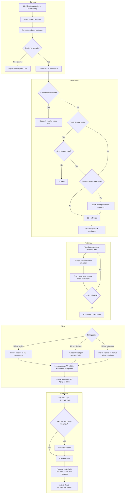
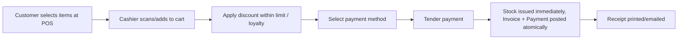

# 5. Complete Business Workflow — Lead to Cash (Order to Delivery)

End-to-end flow tying together every module delivered in Phase 3 (`13`
through `17`). Individual module documents contain the detailed per-module
workflow; this view shows how they chain together and where control/approval
gates sit.

## Alternate Path — Point of Sale (Retail/Restaurant)

For retail, restaurant, and walk-in scenarios, POS collapses Quotation →
Order → Delivery → Invoice → Payment into a single synchronous transaction:

## Control Points Summary

| Gate | Enforced In | Rule Reference |
|---|---|---|
| Blacklisted customer block | Sales Order module | SO Business Rule (Customer BR #2) |
| Credit limit check | Customer / Sales Order modules | CUST-F2, SO Business Rule #2 |
| Discount approval threshold | Sales Quotation / Sales Order | SQ-F6, SO-F3 |
| No self-approval | Sales Order module | SO Business Rule #5 |
| Stock reservation / backorder policy | Sales Order module | SO-F4, SO Business Rule #3 |
| Batch/serial allocation at delivery | Delivery Order module | (see `15-module-delivery-order.md`) |
| Billing policy trigger | Sales Order / Invoice modules | SO-F6 |
| Invoice approval threshold | Invoice/Payment (AR) module | (see `16-module-invoice-payment-ar.md`) |
| Payment approval + segregation of duties | Invoice/Payment (AR) module | (see `16-module-invoice-payment-ar.md`) |
| POS shift/cash-drawer reconciliation | POS module | (see `17-module-pos.md`) |
| POS supervisor override (discount/refund) | POS module | (see `17-module-pos.md`) |

As with Procure-to-Pay, every gate is configurable (thresholds can be set to
zero for effectively-always-approve) but architecturally always present,
since AR Aging, revenue recognition, and audit trail all assume these
checkpoints exist in the data model.
