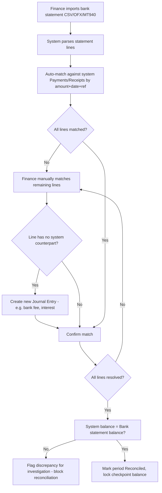

# 3. ERP Modules — Cash Flow & Bank Reconciliation

## Purpose

Give Finance real-time visibility into cash position across all bank/cash
accounts, and ensure the system's cash-account ledger matches actual bank
statements through a structured reconciliation process.

## Business Process — Cash Flow

1. Every posted Journal Entry touching a Cash/Bank-type account contributes
   to a live Cash Position view, categorized by activity (Operating,
   Investing, Financing) via each account/transaction-type's configured
   cash-flow category mapping.
2. Finance views current cash position per bank account and consolidated,
   plus a forward-looking projection combining actual balances with open
   AP (scheduled payments) and open AR (expected receipts, weighted by
   customer payment behavior where available).

## Business Process — Bank Reconciliation

1. Finance imports a bank statement (CSV/OFX/MT940 or manual entry) for a
   given bank account and period.
2. System auto-matches statement lines to system-recorded transactions
   (Payments, Receipts, bank fees/interest) using amount + date + reference
   heuristics.
3. Unmatched lines are manually matched, or a new Journal Entry is created
   for items only visible on the bank side (bank fees, interest income,
   unrecorded direct debits).
4. Once all lines are matched/explained, Finance marks the period
   reconciled; the reconciled balance is locked as a checkpoint.

## Workflow

## Functional Requirements

### Cash Flow

| ID | Requirement |
|---|---|
| CF-F1 | System maintains a live Cash Position dashboard per Cash/Bank account and consolidated across all accounts (multi-currency shown in both original and base-currency equivalent). |
| CF-F2 | System categorizes every Cash/Bank-touching Journal Entry into Operating / Investing / Financing activity via a configurable mapping keyed on the offsetting account or transaction source type. |
| CF-F3 | System generates a Cash Flow Statement (indirect or direct method, company-selectable) for any period, reconciling Net Income to ending cash balance. |
| CF-F4 | System provides a forward-looking Cash Projection combining actual balances, scheduled AP payments (from approved/scheduled Payments), and expected AR receipts (from open Invoices weighted by due date, with optional confidence weighting from historical customer payment lag). |
| CF-F5 | System supports manual Cash Flow forecast line items (e.g. planned capital expenditure not yet in any document) for scenario planning. |

### Bank Reconciliation

| ID | Requirement |
|---|---|
| BR-F1 | System supports bank statement import via CSV template, OFX, and MT940 formats, plus manual line entry. |
| BR-F2 | System auto-matches statement lines to system transactions using configurable heuristics (exact amount + date window + reference substring match), presenting a confidence score per suggested match. |
| BR-F3 | System supports manual match/unmatch of any statement line against any unreconciled system transaction. |
| BR-F4 | System supports creating a new Journal Entry directly from an unmatched bank-only line (e.g. bank fee), pre-filling amount/date and prompting for the offsetting account. |
| BR-F5 | System calculates and displays running reconciliation status: statement balance, system balance, matched total, unmatched/outstanding items (deposits in transit, outstanding checks), and the residual difference (must be zero to close). |
| BR-F6 | System locks a reconciled period's checkpoint balance; transactions dated within a reconciled period cannot be edited/deleted without first reopening the reconciliation (Owner/Finance permission, audit-logged). |
| BR-F7 | System supports multiple bank/cash accounts, each reconciled independently on its own schedule. |

## Business Rules

1. A bank statement import cannot be reconciled/closed while any line remains unmatched or unexplained — the system blocks closure and lists exactly which lines are outstanding.
2. Reconciliation closure requires statement ending balance to exactly equal system ledger balance for that account as of the statement date; any residual difference blocks closure (no "reconcile with variance" shortcut, to preserve GL integrity).
3. Once a period is reconciled, posting a new transaction with a date inside that reconciled period is allowed (e.g. late-arriving documents) but automatically flags the reconciliation as "needs review" rather than silently breaking it.
4. Auto-match confidence below a configurable threshold (default 90%) is presented as a suggestion only, never auto-confirmed — a human must confirm every match.
5. A matched statement line cannot be matched to a second system transaction (1:1 matching by default; many-to-one matching, e.g. one bank deposit covering three POS shift settlements, is supported via an explicit "combine and match" action, not automatically).
6. Cash Flow Statement categorization mappings (Operating/Investing/Financing) are set once per account/transaction-type at Chart of Accounts configuration time and apply consistently; ad-hoc per-transaction recategorization is not permitted (ensures period-over-period comparability).

## Validation

| Field | Rules |
|---|---|
| `bank_statement_import.file` | Required, one of CSV (matching template)/OFX/MT940 format, max 10MB. |
| `bank_statement_line.amount` | Required, non-zero (positive=credit/deposit, negative=debit/withdrawal). |
| `reconciliation.closing_balance` | Required, must equal system ledger balance to close. |
| `cash_flow_mapping.category` | Enum: `operating`, `investing`, `financing`. |

## Permissions

| Permission Key | Description |
|---|---|
| `cashflow.view` | View cash position and cash flow statement. |
| `cashflow.projection.manage` | Add/edit manual forecast line items. |
| `bank-reconciliation.import` | Import bank statements. |
| `bank-reconciliation.match` | Match/unmatch lines. |
| `bank-reconciliation.close` | Close/lock a reconciliation period. |
| `bank-reconciliation.reopen` | Reopen a closed reconciliation (Owner/Finance only). |

## Acceptance Criteria

- Given a bank statement with 50 lines, 47 auto-matched at >=90% confidence and 3 unmatched, the reconciliation screen clearly lists the 3 unmatched lines and blocks the "Close Reconciliation" action until they're resolved.
- Given statement balance = 100,000,000 and system balance = 99,500,000 after all matching, "Close Reconciliation" is blocked and the 500,000 discrepancy is displayed for investigation.
- Given a reconciliation is closed for June, and a Payment is later posted dated June 20th, the June reconciliation flips to "needs review" status automatically (not silently valid, not hard-blocked either).
- Given a Cash Flow Statement is generated for Q2, the sum of Operating + Investing + Financing activity plus beginning cash equals the actual ending cash balance in the GL for all bank/cash accounts.
- Given an auto-match suggestion at 75% confidence, the system does not auto-confirm it; it remains in "suggested" state pending explicit user confirmation.

## API Requirements

| Method | Endpoint | Description |
|---|---|---|
| GET | `/api/cashflow/position` | Live cash position per account + consolidated. |
| GET | `/api/cashflow/statement` | Generate Cash Flow Statement for a period. |
| GET | `/api/cashflow/projection` | Forward-looking projection (actual + scheduled AP/AR + manual forecast lines). |
| GET/POST | `/api/cashflow/projection/manual-lines` | Manage manual forecast line items. |
| POST | `/api/bank-reconciliation/import` | Import a bank statement file. |
| GET | `/api/bank-reconciliation/{account_id}/{period}` | View reconciliation session (lines, match status). |
| POST | `/api/bank-reconciliation/lines/{id}/match` | Match a line to a system transaction. |
| POST | `/api/bank-reconciliation/lines/{id}/unmatch` | Unmatch a line. |
| POST | `/api/bank-reconciliation/lines/{id}/create-journal-entry` | Create JE from unmatched bank-only line. |
| POST | `/api/bank-reconciliation/{id}/close` | Close reconciliation (validates zero residual). |
| POST | `/api/bank-reconciliation/{id}/reopen` | Reopen a closed reconciliation. |

## UI Requirements

**Pages:** Cash Position dashboard (per-account cards + consolidated Chart),
Cash Flow Statement report screen, Cash Projection screen (Chart: actual vs.
projected timeline), Bank Reconciliation workspace (split-view: statement
lines left, system transactions right, drag-or-click-to-match interaction),
Bank Statement Import wizard.

**Components (FlyonUI):** Card (per-account cash summary), Chart (cash trend
line, projection area chart), split-panel Data Table (reconciliation
workspace) with drag-to-match or checkbox-select-then-match interaction,
Badge (match confidence: high/medium/low, color-coded), Modal (create JE from
unmatched line), Stepper (import wizard: upload → preview → confirm), Toast,
progress indicator (X of Y lines resolved) pinned at top of reconciliation
workspace.
