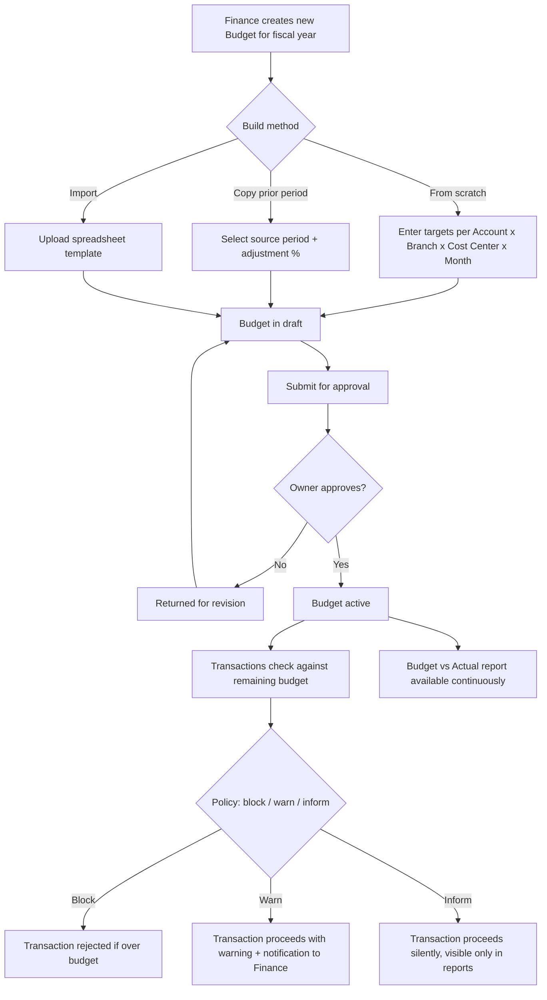

# 3. ERP Modules — Budget

## Purpose

Let Finance/Owner set spending and revenue targets per account, branch,
cost-center, and period, and give the whole company visibility into
actual-vs-budget performance to support both control (blocking/flagging
overspend) and planning.

## Business Process

1. Finance creates a Budget for a fiscal year (or shorter period), allocating
   target amounts per Account (or Account Group) x Branch x Cost Center x
   Month.
2. Budget can be built from scratch, copied from a prior period (with %
   adjustment), or imported from a spreadsheet template.
3. Budget requires approval (Owner) before becoming active.
4. Once active, every relevant transaction (PO approval, Bill posting,
   Journal Entry posting) is checked against remaining budget for its
   account/branch/cost-center/period, and either blocks, warns, or merely
   informs, per company policy.
5. Budget vs. Actual reports give ongoing variance visibility.

## Workflow

## Functional Requirements

| ID | Requirement |
|---|---|
| BUD-F1 | System supports Budget creation scoped to a fiscal year (or custom period), with line-level targets per Account (or Account Group rollup) x Branch (optional) x Cost Center (optional) x Month. |
| BUD-F2 | System supports copying a prior period's actuals or a prior budget as the starting point, with a global or per-line % adjustment. |
| BUD-F3 | System supports budget import via spreadsheet template (XLSX) matching the COA/Branch/Cost-Center structure. |
| BUD-F4 | System supports Budget approval workflow (Owner sign-off) before a budget becomes enforceable. |
| BUD-F5 | System supports configurable enforcement policy per company: `block` (hard-stop transactions exceeding remaining budget), `warn` (allow with notification), `inform` (no interruption, reporting only) — settable per Account Group (e.g. strict on Marketing spend, informational on COGS which scales with revenue). |
| BUD-F6 | System supports Budget revision mid-period (re-approval required for the revised lines), maintaining version history for audit. |
| BUD-F7 | System generates Budget vs. Actual reports at any rollup level (company/branch/cost-center/account), with variance amount and %, drillable down to the underlying transactions. |
| BUD-F8 | System supports multiple concurrent budget scenarios (e.g. "Approved Budget" vs. "Revised Forecast") for comparison, with only one marked as the enforced/active budget at a time per period. |

## Business Rules

1. A transaction check against budget only applies to accounts/periods covered by an **active, approved** budget; accounts/periods with no budget defined are never blocked (absence of a budget line is treated as "unbudgeted, no constraint," not "budget = 0").
2. Under `block` policy, the check is against **remaining** budget (allocated minus already-committed-or-actual), evaluated at the moment of PO approval, Bill posting, or Journal Entry posting — not merely at budget period start.
3. A blocked transaction can still proceed via an explicit Owner/Finance override (separate permission), logged with justification, and the override amount is tracked as a distinct "over-budget-approved" figure in variance reporting (not silently absorbed into the budget line).
4. Budget revision after approval requires re-approval only for the specific lines changed by more than a configurable % threshold (default 10%); minor administrative corrections below that threshold can be saved without re-triggering full approval, per company setting.
5. Deleting an active/approved Budget is not permitted; only a new budget can supersede it (old budget archived, retained for historical Budget-vs-Actual comparison).
6. Budget lines at the Account Group level roll down to constrain the sum of underlying accounts' actuals, not each individual account independently, unless the company opts into account-level granularity.

## Validation

| Field | Rules |
|---|---|
| `budget.fiscal_year` | Required, must align with company's configured fiscal year start month. |
| `budget.lines[].amount` | Required, can be 0 (explicit zero-budget) but not negative. |
| `budget.lines[].account_id` | Required, must be an active, non-control account (or account group). |
| `budget.enforcement_policy` | Enum per account group: `block`, `warn`, `inform`. |

## Permissions

| Permission Key | Description |
|---|---|
| `budget.create` / `.edit` / `.view` | Budget CRUD (Finance). |
| `budget.approve` | Approve a budget or revision (Owner). |
| `budget.override` | Override a blocked over-budget transaction. |
| `budget.report.view` | View Budget vs. Actual reports. |

## Acceptance Criteria

- Given an approved Budget with `block` policy on Marketing (10,000,000/month) and 8,500,000 already committed this month, a new PO of 2,000,000 for a Marketing account is blocked (would total 10,500,000) unless overridden.
- Given no budget line exists for a given Account/Branch/Month combination, transactions against it proceed with no budget-related interruption at all.
- Given a Budget revision changes the Marketing line from 10,000,000 to 15,000,000 (50% increase, above the 10% re-approval threshold), the revision requires Owner re-approval before taking effect.
- Given an over-budget transaction is approved via override, the Budget vs. Actual report shows the line as over 100% with the override amount distinctly annotated (e.g. "10,500,000 / 10,000,000 — 500,000 override-approved").
- Given an attempt to delete an approved active Budget, the API returns `409 BUDGET_IN_USE`; only creating a new superseding budget is permitted.

## API Requirements

| Method | Endpoint | Description |
|---|---|---|
| GET/POST | `/api/budgets` | List / create budgets. |
| GET/PUT | `/api/budgets/{id}` | View/update budget (pre-approval, or revision). |
| POST | `/api/budgets/{id}/submit` | Submit for approval. |
| POST | `/api/budgets/{id}/approve` | Approve budget/revision. |
| POST | `/api/budgets/{id}/reject` | Reject with reason. |
| POST | `/api/budgets/copy-from` | Create new budget copying a prior period with adjustment %. |
| POST | `/api/budgets/import` | Import from spreadsheet template. |
| GET | `/api/budgets/{id}/vs-actual` | Budget vs. Actual report, filterable/drillable. |
| GET | `/api/budgets/check-remaining` | Real-time remaining-budget check (used internally by PO/Bill/JE posting flows). |
| POST | `/api/budgets/override` | Log an override-approved over-budget transaction. |

## UI Requirements

**Pages:** Budget List (by fiscal year), Budget Create/Edit (spreadsheet-like
grid: Accounts x Months, with Branch/Cost-Center tabs or filters), Budget
Approval screen, Budget vs. Actual report (Table + Chart, drillable to
transaction list), Budget Import wizard.

**Components (FlyonUI):** Spreadsheet-style editable Data Table (budget grid,
supports fill-right/copy-down convenience actions), Tabs (Branch/Cost Center
views), Chart (variance bar chart, trend line), Badge (over/under/on-track
color coding), Modal (approve/reject/override with justification), Stepper
(import wizard), Toast, Breadcrumb (drill-down from summary to line to
transaction detail).
