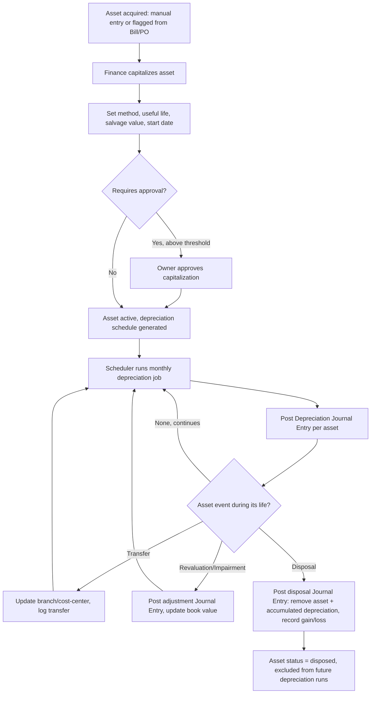

# 3. ERP Modules — Fixed Assets & Depreciation

## Purpose

Track capitalized assets (equipment, vehicles, buildings, machinery) from
acquisition through depreciation to disposal, automatically generating the
corresponding Journal Entries so the Balance Sheet and P&L always reflect
current asset value and period depreciation expense.

## Business Process

1. An asset is capitalized either directly (manual entry, e.g. a building
   purchase) or triggered from a posted Supplier Bill/PO line flagged
   `is_capital_expenditure=true` (linking the asset back to its purchase
   document).
2. Finance sets depreciation method, useful life, salvage value, and
   depreciation start date.
3. A scheduled job runs depreciation calculations each period (monthly by
   default), posting a Depreciation Journal Entry per asset/asset-group.
4. Asset can be transferred between branches/cost-centers, revalued
   (impairment), or disposed of (sold/scrapped), each generating appropriate
   Journal Entries.

## Workflow

## Functional Requirements

| ID | Requirement |
|---|---|
| FA-F1 | System supports Fixed Asset registration: description, category, acquisition date, acquisition cost, useful life, salvage value, depreciation method, assigned branch/cost-center, linked source document (PO/Bill) if applicable. |
| FA-F2 | System supports depreciation methods: Straight-Line, Declining Balance, Double-Declining Balance, Units of Production (configurable per asset category, overridable per asset). |
| FA-F3 | System generates a full depreciation schedule (period-by-period book value) at asset creation, recalculated automatically if method/life/salvage changes (with approval for material changes). |
| FA-F4 | System runs an automated monthly (or configurable frequency) Depreciation job that posts one Journal Entry per asset (or batched per asset category, per company setting) crediting Accumulated Depreciation and debiting Depreciation Expense. |
| FA-F5 | System supports Asset Transfer (branch/cost-center reassignment) with history log, no P&L impact. |
| FA-F6 | System supports Asset Revaluation/Impairment, posting an adjustment Journal Entry and updating the depreciation schedule going forward from the revaluation date. |
| FA-F7 | System supports Asset Disposal (sold or scrapped), capturing disposal proceeds (if sold), calculating gain/loss (proceeds vs. net book value), and posting the disposal Journal Entry (removing asset cost + accumulated depreciation, recognizing gain/loss). |
| FA-F8 | System supports Asset categories with default depreciation policy templates (method, useful life) to speed up data entry for similar assets. |
| FA-F9 | System supports asset attachments (purchase invoice, warranty, insurance documents) and maintenance history linkage (if Manufacturing/Maintenance module is enabled). |
| FA-F10 | System generates a Fixed Asset Register report (all assets, cost, accumulated depreciation, net book value) as of any date. |

## Business Rules

1. Depreciation cannot start before an asset's acquisition date, and does not run past its useful life end date or disposal date, whichever comes first.
2. An asset's depreciation method/useful life/salvage value cannot be changed retroactively for already-posted depreciation periods; changes apply prospectively from the change date, with the remaining net book value re-amortized over the (possibly revised) remaining life.
3. Disposal is only permitted once; a disposed asset cannot be un-disposed — corrections require a reversing Journal Entry plus re-creating the asset record if disposal was made in error.
4. Net book value can never depreciate below the asset's salvage value; the depreciation job automatically caps the final period's expense to bring book value exactly to salvage value, not below.
5. Assets acquired via a flagged capital-expenditure Bill/PO line are auto-linked but still require Finance to explicitly complete capitalization (set method/life/salvage) — the system does not guess these values.
6. Asset Revaluation (impairment) can only decrease book value (write-down) by default; upward revaluation (write-up) requires a separate permission and is disallowed entirely in jurisdictions/company settings that follow historical-cost-only accounting policy (configurable).
7. Depreciation Journal Entries are system-generated and immutable like other automated entries — corrections happen via the next period's run reflecting updated parameters, or an explicit adjustment entry, never by editing a posted depreciation JE.

## Validation

| Field | Rules |
|---|---|
| `asset.acquisition_cost` | Required, > 0. |
| `asset.useful_life_months` | Required, > 0. |
| `asset.salvage_value` | Required, >= 0, < acquisition_cost. |
| `asset.depreciation_method` | Enum: `straight_line`, `declining_balance`, `double_declining_balance`, `units_of_production`. |
| `asset_disposal.disposal_date` | Required, must be >= acquisition date and <= today. |
| `asset_disposal.proceeds` | Required if `disposal_type=sold`, >= 0. |

## Permissions

| Permission Key | Description |
|---|---|
| `fixed-asset.create` / `.edit` / `.view` | Asset CRUD (Finance). |
| `fixed-asset.capitalize.approve` | Approve capitalization above threshold (Owner). |
| `fixed-asset.transfer` | Transfer asset between branch/cost-center. |
| `fixed-asset.revalue` | Create a revaluation/impairment entry. |
| `fixed-asset.dispose` | Process asset disposal. |
| `fixed-asset.register.view` | View Fixed Asset Register report. |

## Acceptance Criteria

- Given a Straight-Line asset of 120,000,000 acquisition cost, 12,000,000 salvage value, 60-month life, monthly depreciation is exactly (120,000,000 − 12,000,000) / 60 = 1,800,000, and after 60 periods book value equals exactly 12,000,000, never less.
- Given an asset is disposed at month 30 (before its 60-month schedule completes), depreciation stops and a disposal Journal Entry posts removing the asset's cost and accumulated depreciation, recognizing gain/loss = proceeds − net book value at disposal.
- Given a depreciation method change is made at month 24, periods 1–23's posted Journal Entries remain unchanged; period 24 onward recalculates based on the new method and remaining net book value.
- Given a company's setting disallows upward revaluation, attempting to increase an asset's book value via revaluation returns `403 UPWARD_REVALUATION_NOT_ALLOWED`.
- Given the Fixed Asset Register is run for a specific date, every active asset shows cost, accumulated depreciation as of that date, and net book value that reconciles to the GL Fixed Assets and Accumulated Depreciation account balances.

## API Requirements

| Method | Endpoint | Description |
|---|---|---|
| GET/POST | `/api/fixed-assets` | List / create/capitalize assets. |
| GET/PUT | `/api/fixed-assets/{id}` | View/update asset (prospective changes only). |
| POST | `/api/fixed-assets/{id}/approve` | Approve capitalization above threshold. |
| GET | `/api/fixed-assets/{id}/depreciation-schedule` | Full period-by-period schedule. |
| POST | `/api/fixed-assets/{id}/transfer` | Transfer branch/cost-center. |
| POST | `/api/fixed-assets/{id}/revalue` | Create revaluation entry. |
| POST | `/api/fixed-assets/{id}/dispose` | Process disposal. |
| GET | `/api/fixed-assets/register` | Fixed Asset Register report as of a date. |
| POST | `/api/fixed-assets/run-depreciation` | Manually trigger the depreciation job (also runs via Scheduler). |
| GET/POST | `/api/fixed-asset-categories` | Manage asset categories + default depreciation templates. |

## UI Requirements

**Pages:** Asset List (Table, filters: category/branch/status), Asset
Create/Capitalize form (with source-document link if from Bill/PO), Asset
Detail (Tabs: General, Depreciation Schedule, Transfers, Revaluations,
Disposal, Documents, Maintenance History), Fixed Asset Register report,
Asset Category management.

**Components (FlyonUI):** Data Table, Chart (book-value-over-time line per
asset), Tabs, Drawer (create/edit), Timeline (transfer/revaluation/disposal
history), Modal (dispose confirmation with gain/loss preview calculated
live), Badge (status: active/disposed/fully_depreciated), Toast, Breadcrumb
(Register → Category → Asset drill-down).
