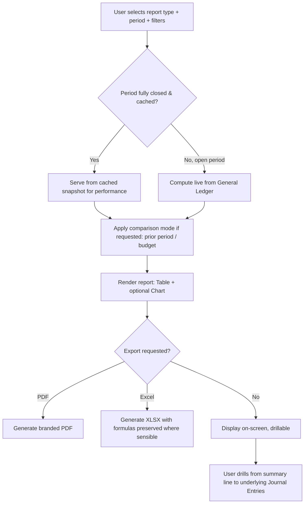

# 3. ERP Modules — Financial Reports (Profit & Loss, Balance Sheet, Tax)

## Purpose

Turn the General Ledger (posted Journal Entries, per `10-module-accounting-core.md`)
into the standard financial statements Finance, Owner, Director, and Auditor
roles need — Profit & Loss, Balance Sheet, and Tax summary reports — plus the
underlying reporting engine pattern reused by every other module's reports in
later phases (Section 13 domain reports: Sales, Purchasing, Inventory, HR,
Manufacturing, Projects, delivered alongside each respective module).

## Business Process

1. Every report in this document reads exclusively from posted GL entries
   (`accounting.journal_entries` + `general_ledger`, never draft/pending
   data) — ensuring reports always reflect a fully-audited, balanced state.
2. Reports support a comparison mode (this period vs. prior period, or vs.
   budget from `20-module-budget.md`) and multiple output formats (on-screen,
   PDF export, Excel export).
3. Reports respect fiscal period locking — a locked/closed period's figures
   are stable and cached for performance; open-period figures are computed
   live.
4. Consolidated multi-company reports (for Owners who own multiple legal
   entities under one platform account) aggregate figures cross-company via
   the explicit `reports.consolidated.view` permission escape hatch defined
   in `03-database-design-core.md` §6.4.

## Workflow — Report Generation

## Functional Requirements

| ID | Requirement |
|---|---|
| FR-F1 | System generates a Profit & Loss (Income Statement) for any date range, structured by the COA's Revenue/COGS/Expense hierarchy, with subtotals (Gross Profit, Operating Income, Net Income). |
| FR-F2 | System generates a Balance Sheet as of any date, structured by Asset/Liability/Equity hierarchy, validating the fundamental accounting equation (Assets = Liabilities + Equity) as an internal consistency check on every generation. |
| FR-F3 | System supports comparison columns: prior period (month/quarter/year), prior year same period, and budget (from `20-module-budget.md`) — variance amount and % shown alongside each. |
| FR-F4 | System supports report segmentation by Branch, Cost Center, and Project dimension (where used), in addition to company-consolidated view. |
| FR-F5 | Every report line is drillable: clicking a P&L or Balance Sheet line opens the underlying Journal Entry list contributing to that balance, and further into each entry's source document. |
| FR-F6 | System generates a Tax Summary report (output tax collected on Sales, input tax paid on Purchases, net tax position) for a configurable tax period, feeding statutory filing preparation (actual e-filing integration is out of scope per `01-executive-summary.md` §1.5). |
| FR-F7 | System supports scheduled report generation (e.g. auto-email monthly P&L to Owner/Finance on the 1st of each month) via the Scheduler + Notification Center. |
| FR-F8 | System exports every report to PDF (branded) and Excel (XLSX, with underlying data in a machine-readable sheet alongside the formatted view). |
| FR-F9 | System caches closed-period report snapshots for performance; open-period reports compute live and are never cached (to avoid stale figures during active bookkeeping). |
| FR-F10 | System supports a Financial Ratio panel (gross margin %, operating margin %, current ratio, quick ratio, debt-to-equity) computed from the same underlying P&L/Balance Sheet data. |

## Business Rules

1. Reports never include draft or pending-approval Journal Entries — only `posted` status entries contribute to any financial statement, keeping statements audit-safe by construction.
2. A Balance Sheet that fails the Assets = Liabilities + Equity check (which should be structurally impossible given `10-module-accounting-core.md` Business Rule #1 and #8) surfaces a hard system-integrity alert to Owner/Finance rather than silently displaying an unbalanced statement — this is treated as a data-integrity incident, not a normal report state.
3. Comparison-to-budget columns only appear for periods covered by an approved, active budget (per `20-module-budget.md` Business Rule #1); periods without a budget show comparison-to-prior-period only.
4. Drill-down from a report line to Journal Entries respects the viewing user's permissions — an Auditor can drill all the way to entry detail (read-only), while a role without `accounting.gl.view` sees only the aggregate report line, not the drill-down option.
5. Cached closed-period snapshots are invalidated and regenerated automatically if a closed period is reopened (per `10-module-accounting-core.md` GL-F8) and a correcting entry is posted, then re-closed.
6. Multi-currency accounts are always presented in company base currency on P&L/Balance Sheet (translated at period-end/spot rate per company policy), with the original-currency figures available as a supplementary drill-down detail, never as the primary statement figure.

## Validation

| Field | Rules |
|---|---|
| `report_request.date_from` / `date_to` | Required for P&L/Tax Summary; `date_to` required (single as-of date) for Balance Sheet. |
| `report_request.comparison_mode` | Enum: `none`, `prior_period`, `prior_year`, `budget`. |
| `report_request.segment_by` | Enum: `none`, `branch`, `cost_center`, `project`. |
| `scheduled_report.frequency` | Enum: `monthly`, `quarterly`, `on_period_close`. |

## Permissions

| Permission Key | Description |
|---|---|
| `reports.pnl.view` | View Profit & Loss. |
| `reports.balance-sheet.view` | View Balance Sheet. |
| `reports.tax-summary.view` | View Tax Summary. |
| `reports.financial.export` | Export reports to PDF/Excel. |
| `reports.financial.schedule` | Configure scheduled auto-delivery. |
| `reports.consolidated.view` | View multi-company consolidated reports (Owner, cross-entity). |

## Acceptance Criteria

- Given a P&L generated for Q2, Net Income equals Total Revenue minus Total COGS minus Total Operating Expenses, and this figure matches the change in Retained Earnings on the Balance Sheet between Q1-end and Q2-end (net of any dividends/drawings entries).
- Given a Balance Sheet as of any date, Total Assets always exactly equals Total Liabilities + Total Equity — verified programmatically on every generation, not just visually.
- Given a period has an approved budget, the P&L for that period shows a Budget column with variance; given no budget exists, the column is omitted (not shown as zeroes/blanks).
- Given an Auditor drills into a Balance Sheet "Accounts Payable" line, they reach the list of contributing Journal Entries (read-only) and can further open each entry's source Bill — but cannot edit or approve anything along the way.
- Given a closed period's cached P&L snapshot exists, reopening that period and posting a correction invalidates the cache; the next report request for that period recomputes live and reflects the correction.

## API Requirements

| Method | Endpoint | Description |
|---|---|---|
| GET | `/api/reports/profit-loss` | Generate P&L for a date range, with comparison/segment options. |
| GET | `/api/reports/balance-sheet` | Generate Balance Sheet as of a date. |
| GET | `/api/reports/tax-summary` | Generate Tax Summary for a tax period. |
| GET | `/api/reports/financial-ratios` | Generate ratio panel for a period. |
| GET | `/api/reports/{report_type}/export` | Export a report to PDF or XLSX (`?format=pdf|xlsx`). |
| GET/POST | `/api/reports/scheduled` | List / configure scheduled report deliveries. |
| GET | `/api/reports/{report_type}/drill-down` | Get underlying Journal Entries for a specific report line. |
| GET | `/api/reports/consolidated/profit-loss` | Cross-company consolidated P&L (Owner, multi-entity). |

## UI Requirements

**Pages:** Profit & Loss report screen (Table with expand/collapse account
groups, comparison columns, Chart toggle), Balance Sheet report screen
(same pattern), Tax Summary report screen, Financial Ratios panel (Dashboard
widget + standalone page), Scheduled Reports configuration screen.

**Components (FlyonUI):** Data Table with expandable/collapsible row groups
(account hierarchy), Chart (trend line for selected accounts, waterfall for
P&L breakdown), Tabs (report type switcher: P&L / Balance Sheet / Tax /
Ratios), Dropdown (period selector, comparison mode selector, segment-by
selector), Breadcrumb (drill-down trail), Badge (integrity-check indicator —
green "Balanced" always shown on Balance Sheet header), Export button group
(PDF/Excel), Skeleton loaders for live (open-period) computation, Command
Palette shortcut for quick report jump.
