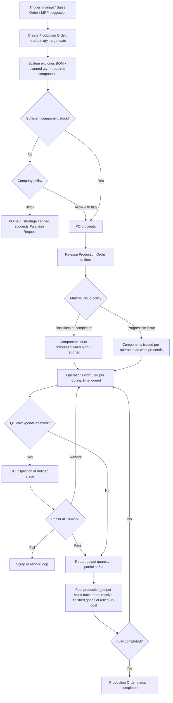

# 3. ERP Modules — Bill of Materials & Production Order

## Purpose

Define how finished/semi-finished products are manufactured (Bill of
Materials) and execute the actual manufacturing process (Production Order),
consuming raw material stock and producing finished-goods stock with full
cost roll-up.

## Business Process — Bill of Materials (BOM)

1. An Engineering/Product-owner role (typically delegated Owner/Production
   permission) defines a BOM for a `stockable` product: a list of component
   products + quantities (per 1 unit of output), plus optional routing steps
   (operations, work centers, standard time) if operation-level costing is
   needed.
2. BOMs support multi-level nesting (a BOM component can itself be a
   manufactured product with its own BOM), enabling sub-assembly costing.
3. BOM versions are maintained (effective-dated) so historical Production
   Orders reference the BOM version active at their creation time.

## Business Process — Production Order (PO — manufacturing, distinct from
Purchase Order)

1. Production is created manually, from a Sales Order (make-to-order), or
   from MRP output (make-to-stock replenishment).
2. System checks component availability against the BOM x planned quantity;
   insufficient components can either block, or proceed with a shortage
   flag (feeds MRP/Purchase Request suggestion), per company policy.
3. Production Order is released to the floor; material is issued (consumed)
   either at release (backflush) or progressively as operations complete.
4. Upon completion, finished goods are received into inventory at
   calculated cost (component costs + labor/overhead allocation per routing,
   if used).
5. Partial completions are supported (e.g. 600 of 1000 units completed this
   shift).

## Workflow

## Functional Requirements — BOM

| ID | Requirement |
|---|---|
| BOM-F1 | System supports multi-level BOM definition: parent product, component products + quantity per 1 unit of parent output, unit of measure, scrap/waste %. |
| BOM-F2 | System supports BOM versioning with effective-date ranges; a Production Order locks to the BOM version active at its creation. |
| BOM-F3 | System supports optional Routing definition (sequence of operations, work center, standard time per operation) for labor/overhead cost allocation and shop-floor scheduling. |
| BOM-F4 | System calculates a rolled-up Standard Cost per finished product by recursively exploding nested BOMs (component material cost + routing labor/overhead cost). |
| BOM-F5 | System supports BOM "where-used" lookup: given a component, list all parent products/BOMs that consume it (critical for engineering-change-impact analysis). |
| BOM-F6 | System supports BOM approval workflow for changes above a configurable cost-impact threshold. |

## Functional Requirements — Production Order

| ID | Requirement |
|---|---|
| PROD-F1 | System supports Production Order creation: manual, from Sales Order (make-to-order, linked), or from MRP suggestion (make-to-stock). |
| PROD-F2 | System explodes the product's active BOM x planned quantity into required component quantities, checked against current stock availability. |
| PROD-F3 | System supports configurable shortage policy: `block` (cannot release with insufficient components) or `allow_with_flag` (releases, flags shortage, suggests Purchase Request/further Production Order for the missing component). |
| PROD-F4 | System supports material issue policy per company/product: `backflush` (components auto-consumed proportional to reported output, simpler for high-volume/low-value items) or `progressive` (explicit issue transactions per operation, for high-value/serial-tracked components). |
| PROD-F5 | System supports partial output reporting (multiple completion postings against one Production Order) with cost captured per completion batch. |
| PROD-F6 | System calculates actual production cost per completed unit: consumed component actual cost (per each component's valuation method) + labor cost (routing standard time x work-center rate, or actual logged time) + overhead allocation (configurable %, or activity-based). |
| PROD-F7 | System supports Production Order statuses: `draft` → `released` → `in_progress` → `completed` / `partially_completed` / `cancelled`. |
| PROD-F8 | System supports scrap/rework reporting at any operation, distinct from the main output quantity, feeding QC and cost-variance reporting. |
| PROD-F9 | System supports Work Center capacity view (planned load vs. available capacity) for basic shop-floor scheduling, independent of the more advanced MRP capacity planning. |

## Business Rules

1. A Production Order's BOM reference is locked at creation time; subsequent BOM version changes do not retroactively alter an in-progress or completed Production Order.
2. Component consumption (whether backflush or progressive) can never be reported in a quantity that would drive inventory negative at a warehouse with `allow_negative_stock=false` — the same rule as `06-module-inventory-stock.md` applies uniformly.
3. Finished-goods output quantity cannot exceed planned quantity by more than a configurable over-production tolerance (default 0%, i.e. exact or under by default) without an explicit override, to prevent uncontrolled over-production skewing cost averages.
4. Actual production cost per unit varies by completion batch if component costs fluctuated between batches (e.g. FIFO layer changes) — the system does not force a single blended cost across all batches of one Production Order; each completion batch is costed independently and accurately.
5. A Production Order cannot be cancelled after any output has been reported; only the un-produced remainder can be cancelled, mirroring the Sales/Purchase Order partial-cancellation pattern.
6. Scrap reported at an operation is a real inventory-affecting event (removes consumed component value from work-in-process, does not become finished-goods stock) and must be recorded with a reason code for yield-loss analysis.
7. Nested BOM recursion is validated at save time to prevent circular references (Product A's BOM containing Product B, whose BOM contains Product A) — rejected as invalid.

## Validation

| Field | Rules |
|---|---|
| `bom.components[].quantity_per_unit` | Required, > 0. |
| `bom.effective_from` | Required; `effective_to` if present must be after `effective_from`. |
| `production_order.planned_quantity` | Required, > 0. |
| `production_order.product_id` | Required, must have an active BOM as of the order's creation date. |
| `production_completion.reported_quantity` | Required, > 0, <= remaining planned quantity + over-production tolerance. |

## Permissions

| Permission Key | Description |
|---|---|
| `manufacturing.bom.view` | View BOM structure (Production role default). |
| `manufacturing.bom.manage` | Create/edit BOM (Engineering/Owner delegated). |
| `manufacturing.bom.approve` | Approve BOM changes above cost-impact threshold. |
| `manufacturing.production-order.create` / `.view` | Production Order CRUD. |
| `manufacturing.production-order.release` | Release order to the floor. |
| `manufacturing.production-order.report-output` | Report completion/scrap quantities. |
| `manufacturing.production-order.cancel` | Cancel order/remainder. |

## Acceptance Criteria

- Given a BOM for Product X requires 2 units of Component A and 1 unit of Component B per finished unit, a Production Order for 100 units of X requires 200 of A and 100 of B, checked against current stock.
- Given shortage policy `block` and insufficient Component B stock, attempting to release the Production Order is rejected with the exact shortfall quantity shown.
- Given backflush issue policy, reporting 60 completed units auto-consumes 120 of Component A and 60 of Component B proportionally, without a separate manual issue transaction.
- Given a Production Order for 1000 units has 600 reported complete and is then cancelled, the remaining 400 units are cancelled while the 600 completed units and their consumed components remain on record.
- Given a circular BOM reference (A contains B, B contains A) is attempted, the save is rejected with `422 CIRCULAR_BOM_REFERENCE`.

## API Requirements

| Method | Endpoint | Description |
|---|---|---|
| GET/POST | `/api/manufacturing/boms` | List / create BOMs. |
| GET/PUT | `/api/manufacturing/boms/{id}` | View/update BOM (new version on material change). |
| GET | `/api/manufacturing/boms/{id}/cost-rollup` | Calculated standard cost breakdown. |
| GET | `/api/manufacturing/boms/where-used/{product_id}` | Where-used lookup for a component. |
| GET/POST | `/api/manufacturing/production-orders` | List / create Production Orders. |
| GET | `/api/manufacturing/production-orders/{id}` | View detail incl. component requirements/availability. |
| POST | `/api/manufacturing/production-orders/{id}/release` | Release to floor. |
| POST | `/api/manufacturing/production-orders/{id}/issue-materials` | Progressive material issue. |
| POST | `/api/manufacturing/production-orders/{id}/report-output` | Report completed/scrap quantity. |
| POST | `/api/manufacturing/production-orders/{id}/cancel` | Cancel order/remainder. |
| GET | `/api/manufacturing/work-centers/capacity` | Planned load vs. capacity view. |

## UI Requirements

**Pages:** BOM List/Tree, BOM Create/Edit (component grid + routing tab),
BOM Cost Rollup viewer, Where-Used lookup screen, Production Order List
(Table, filters: status/product/work-center), Production Order Create
(product/qty/date + auto-computed component requirement grid with
availability indicators), Production Order Detail (Tabs: Components,
Routing/Operations, Output/Completions, Scrap, Cost Summary), Work Center
Capacity board.

**Components (FlyonUI):** Tree view (nested BOM), Data Table (component grid
with availability Badge: sufficient/short), Drawer/form (BOM & PO creation),
Timeline (PO status progression + completion batches), Kanban-style board
(Work Center capacity/scheduling), Modal (report output/scrap with reason
code), Chart (cost breakdown pie: material/labor/overhead), Badge (shortage
warning), Toast.
