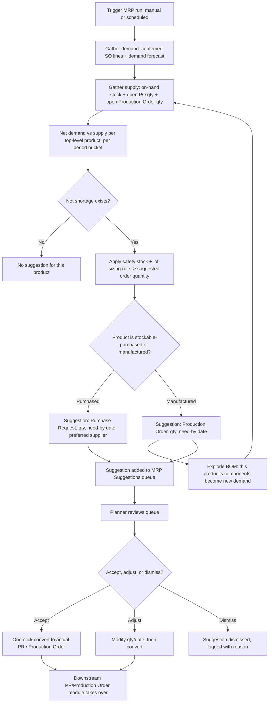

# 3. ERP Modules — MRP (Material Requirements Planning)

## Purpose

Automatically calculate what needs to be produced or purchased, in what
quantity, and by when, by netting demand (sales orders, forecasted demand,
safety stock policy) against supply (on-hand stock, open Purchase Orders,
open Production Orders), exploding through multi-level BOMs.

## Business Process

1. MRP run is triggered manually or on a schedule (e.g. nightly), scoped to
   a planning horizon (e.g. next 90 days) and a set of products/warehouses.
2. For each finished/semi-finished product with demand (confirmed Sales
   Orders, optionally + a demand forecast), MRP nets against on-hand +
   incoming supply (open POs, open Production Orders) considering safety
   stock and lot-sizing rules.
3. Net shortages explode through the BOM recursively — a shortage of a
   finished good generates component-level requirements, which themselves
   net against component stock/incoming supply, and so on down the BOM tree.
4. MRP output is a set of **suggestions**: "Create Purchase Request for X
   qty of Component A by date D" or "Create Production Order for Y qty of
   Sub-Assembly B by date D" — never auto-creates binding documents without
   human review and action.
5. Planner reviews suggestions, converts accepted ones into actual Purchase
   Requests / Production Orders (one click), dismisses/adjusts others.

## Workflow

## Functional Requirements

| ID | Requirement |
|---|---|
| MRP-F1 | System runs MRP calculation on demand (manual trigger) or on a configurable schedule (via Laravel Scheduler), scoped to a planning horizon and optional product/warehouse/category filter. |
| MRP-F2 | System nets demand (confirmed Sales Order lines within horizon, plus optional manually-entered demand forecast per product/period) against supply (on-hand stock + open incoming PO quantity + open Production Order planned output). |
| MRP-F3 | System applies per-product/per-warehouse safety stock (minimum buffer) and lot-sizing rules (`lot_for_lot`, `fixed_order_quantity`, `min_max`) when calculating suggested order quantities. |
| MRP-F4 | System recursively explodes net requirements through multi-level BOMs (reusing `23-module-bom-production-order.md`'s BOM data), generating component-level suggestions from finished-good shortages. |
| MRP-F5 | System calculates suggested need-by/order-by dates working backward from the demand date using each product's configured lead time (purchase lead time for purchased items, production lead time for manufactured items). |
| MRP-F6 | System produces suggestions only — never auto-creates binding Purchase Requests or Production Orders without explicit planner action, preserving human-in-the-loop control. |
| MRP-F7 | System supports one-click conversion of an accepted suggestion into an actual Purchase Request (pre-filled, routed through normal PR approval) or Production Order (pre-filled, routed through normal release process). |
| MRP-F8 | System supports suggestion dismissal with a mandatory reason code, retained for planning-accuracy review (were dismissed suggestions later needed anyway?). |
| MRP-F9 | System provides a Pegging view per suggestion: traces exactly which demand (which Sales Order / which parent Production Order) drove this specific suggestion, for planner confidence and prioritization. |
| MRP-F10 | System supports "what-if" simulation runs (not persisted, sandbox calculation) to preview MRP output before committing to a scheduled run, useful when evaluating a large hypothetical order. |

## Business Rules

1. MRP suggestions are always advisory; converting a suggestion into a PR/Production Order goes through that document type's own full approval/validation workflow — MRP does not bypass any control point defined elsewhere.
2. Re-running MRP does not duplicate suggestions for demand already covered by an existing open PR/Production Order (whether MRP-originated or manually created) — the netting calculation always considers current open-document supply, preventing double-ordering.
3. A dismissed suggestion does not reappear on the next MRP run for the identical demand/period unless the underlying demand or supply situation materially changes (e.g. the covering PO is cancelled) — dismissal is remembered, not just skipped once.
4. Safety stock and lot-sizing rule changes only affect future MRP runs; they do not retroactively flag already-converted suggestions as wrong.
5. BOM explosion during MRP always uses the currently active BOM version for each product (not a specific locked version, since MRP is forward-looking planning, unlike an actual Production Order which locks its BOM at creation).
6. Pegging traceability must survive suggestion-to-document conversion — once a suggestion becomes a real PR/Production Order, the link back to the originating demand (Sales Order or parent Production Order) is preserved on the resulting document, not lost.

## Validation

| Field | Rules |
|---|---|
| `mrp_run.horizon_days` | Required, > 0, max configurable ceiling (default 365) to bound computation cost. |
| `product_planning_settings.safety_stock` | Numeric, >= 0. |
| `product_planning_settings.lot_sizing_rule` | Enum: `lot_for_lot`, `fixed_order_quantity`, `min_max`. |
| `product_planning_settings.lead_time_days` | Required if product is purchasable/manufacturable, > 0. |
| `mrp_suggestion.dismiss_reason` | Required when dismissing a suggestion. |

## Permissions

| Permission Key | Description |
|---|---|
| `manufacturing.mrp.run` | Trigger an MRP run (manual or configure schedule). |
| `manufacturing.mrp.view` | View MRP suggestions and pegging detail. |
| `manufacturing.mrp.convert` | Convert a suggestion to PR/Production Order. |
| `manufacturing.mrp.dismiss` | Dismiss a suggestion with reason. |
| `manufacturing.mrp.settings.manage` | Configure per-product safety stock/lot-sizing/lead time. |

## Acceptance Criteria

- Given a confirmed Sales Order needs 500 units of a finished good in 30 days, current stock is 100, and an open Production Order will yield 200 more, MRP suggests a new Production Order for the net 200 shortfall (500 − 100 − 200), not the full 500.
- Given that suggested Production Order for 200 units is accepted and converted, re-running MRP immediately after does not generate a duplicate suggestion for the same demand.
- Given a finished-good shortage triggers a Production Order suggestion, and that product's BOM requires Component C which is also short, MRP additionally suggests a Purchase Request for Component C, correctly netted against C's own on-hand/incoming supply.
- Given a suggestion is dismissed with reason "manual order already placed outside system," it does not reappear on the next scheduled run for the same demand period, but does reappear if that manual coverage is later found insufficient (demand/supply situation changes).
- Given a planner opens the Pegging view for a suggestion, they can trace it back to the exact Sales Order line(s) that generated the underlying demand.

## API Requirements

| Method | Endpoint | Description |
|---|---|---|
| POST | `/api/manufacturing/mrp/run` | Trigger an MRP run (sync for small scope, queued job for large horizon/catalog). |
| GET | `/api/manufacturing/mrp/runs/{id}` | View a completed run's summary. |
| GET | `/api/manufacturing/mrp/suggestions` | List current suggestions, filterable by product/type/urgency. |
| GET | `/api/manufacturing/mrp/suggestions/{id}/pegging` | Pegging detail for a suggestion. |
| POST | `/api/manufacturing/mrp/suggestions/{id}/convert` | Convert to PR or Production Order. |
| POST | `/api/manufacturing/mrp/suggestions/{id}/dismiss` | Dismiss with reason. |
| POST | `/api/manufacturing/mrp/simulate` | Run a non-persisted what-if simulation. |
| GET/PUT | `/api/manufacturing/product-planning-settings/{product_id}` | View/update safety stock, lot-sizing, lead time per product/warehouse. |

## UI Requirements

**Pages:** MRP Run configuration/trigger screen, MRP Suggestions queue
(Table: product, suggestion type, quantity, need-by date, urgency Badge),
Suggestion Detail with Pegging trace, What-If Simulation sandbox screen,
Product Planning Settings (per-product safety stock/lot-sizing/lead-time
form).

**Components (FlyonUI):** Data Table with urgency-sorted rows (color-coded:
overdue/red, this-week/amber, later/green), Drawer (suggestion detail +
pegging tree view), Modal (convert-to-document confirmation with pre-filled
preview, dismiss-with-reason form), Tree view (pegging trace, BOM explosion
path), Toast, Chart (demand vs. supply timeline per product), Skeleton for
long-running MRP calculations with progress indicator.
