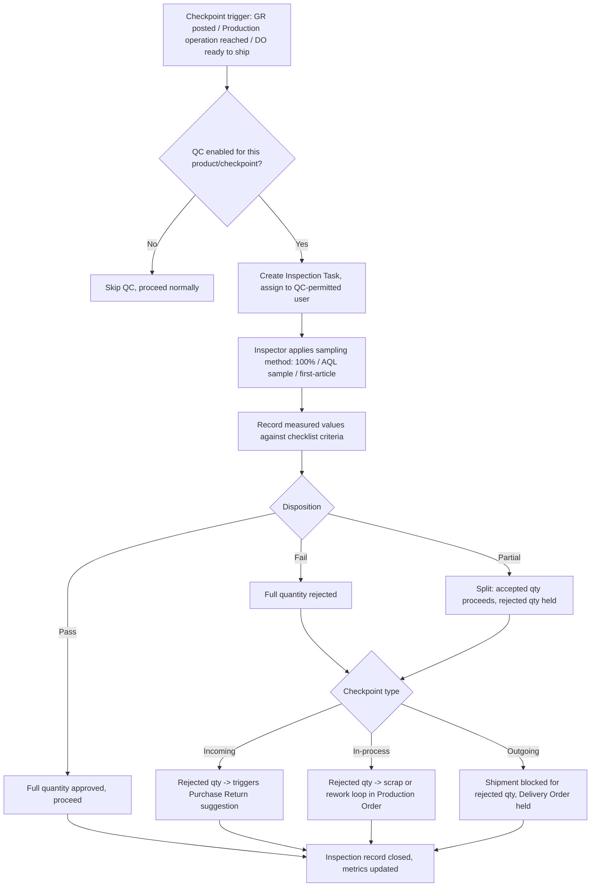

# 3. ERP Modules — Quality Control

## Purpose

Enforce inspection checkpoints at key points in the physical goods flow —
incoming (Goods Receipt), in-process (Production Order operations), and
outgoing (Delivery Order) — recording pass/fail/rework dispositions and
feeding supplier performance, production yield, and customer complaint
analytics.

## Business Process

1. QC is configured per product/category/checkpoint type (incoming,
   in-process, outgoing), specifying an inspection plan: criteria/checklist,
   sampling method (100%, AQL sampling, first-article), and acceptance
   thresholds.
2. When a checkpoint is triggered (a Goods Receipt posted for a QC-enabled
   product, a Production Order operation reaching a QC gate, a Delivery
   Order about to ship a QC-enabled product), an inspection task is created
   and routed to a QC-permitted user.
3. Inspector records measured/observed values against the checklist,
   resulting in a disposition: Pass, Fail, or Partial (split accept/reject
   quantity), with optional rework routing.
4. Disposition drives downstream action: incoming-fail triggers Purchase
   Return; in-process-fail triggers scrap/rework in Production Order;
   outgoing-fail blocks shipment.

## Workflow

## Functional Requirements

| ID | Requirement |
|---|---|
| QC-F1 | System supports configurable Inspection Plans per product/category x checkpoint type (`incoming`, `in_process`, `outgoing`), defining a checklist of criteria (each with type: pass/fail, numeric-range, text-observation). |
| QC-F2 | System supports sampling methods: 100% inspection, AQL (Acceptable Quality Level) statistical sampling with configurable inspection level/AQL %, and first-article-only (inspect only the first unit/batch of a new production run). |
| QC-F3 | System auto-creates an Inspection Task when a configured checkpoint is triggered (GR posted, Production operation reaching a QC gate per its routing, DO ready to ship), assigned to a QC-permitted user or queue. |
| QC-F4 | System supports disposition recording: Pass (full qty), Fail (full qty), Partial (explicit accept/reject quantity split), each with inspector notes and optional photo/document attachment. |
| QC-F5 | System integrates disposition outcomes with the triggering module: incoming-fail creates a Purchase Return suggestion (per `09-module-goods-receipt-purchase-return.md`); in-process-fail routes to scrap/rework in the Production Order (per `23-module-bom-production-order.md`); outgoing-fail blocks the Delivery Order's affected quantity. |
| QC-F6 | System supports Non-Conformance Report (NCR) creation for significant failures, tracking root-cause analysis and corrective action (CAPA — Corrective and Preventive Action) with due dates and owners. |
| QC-F7 | System calculates and surfaces quality metrics: first-pass yield %, defect rate by product/supplier/work-center, NCR aging, feeding Supplier performance (`07-module-supplier.md` SUP-F6) and Manufacturing yield reporting. |
| QC-F8 | System supports Certificate of Analysis / Conformance generation (PDF) for regulated industries (Pharma, Food, Construction materials) documenting the inspection result per batch/lot. |

## Business Rules

1. Goods held at an incoming QC checkpoint do not count toward `quantity_available` (per `06-module-inventory-stock.md` Business Rule #3) until disposition is recorded — QC hold is a real inventory state, not just a task-tracking overlay.
2. A Delivery Order cannot ship a quantity still pending outgoing QC disposition; the shipment is blocked at the affected line level only (other lines on the same DO not requiring QC, or already passed, are unaffected).
3. An Inspection Task's sampling method is fixed by the Inspection Plan configuration at trigger time; the inspector cannot unilaterally reduce sampling rigor (e.g. skip AQL sampling and inspect only 1 unit) without a documented, permitted override.
4. A Fail or Partial disposition on an incoming or outgoing checkpoint requires a mandatory reason/criteria-reference (which checklist item failed), never a bare "failed" with no detail — this feeds root-cause analytics.
5. NCR records, once created, cannot be deleted (audit/compliance requirement); they can be closed with a documented corrective action, but the history is permanent.
6. Quality metrics (first-pass yield, defect rate) are calculated from actual posted disposition records only, never from estimated/sampled projections presented as exact figures — the UI must distinguish "based on X inspected units" when sampling (not 100%) was used.

## Validation

| Field | Rules |
|---|---|
| `inspection_plan.checkpoint_type` | Enum: `incoming`, `in_process`, `outgoing`. |
| `inspection_plan.sampling_method` | Enum: `full`, `aql`, `first_article`. |
| `inspection_task.disposition` | Enum: `pass`, `fail`, `partial`; required before task can close. |
| `inspection_task.rejected_quantity` | Required if disposition is `fail` or `partial`, > 0, <= inspected quantity. |
| `ncr.reason_code` | Required, from a configurable NCR reason taxonomy. |

## Permissions

| Permission Key | Description |
|---|---|
| `manufacturing.qc.inspect` | Perform inspections, record disposition. |
| `manufacturing.qc.plan.manage` | Configure Inspection Plans. |
| `manufacturing.qc.ncr.manage` | Create/manage NCRs and CAPA. |
| `manufacturing.qc.override-sampling` | Override configured sampling method (restricted, logged). |
| `manufacturing.qc.certificate.generate` | Generate Certificate of Analysis/Conformance. |

## Acceptance Criteria

- Given an incoming QC-enabled product is received via GR, the received quantity is held (excluded from `quantity_available`) until an Inspection Task disposition is recorded.
- Given a Partial disposition of 80 pass / 20 fail on a 100-unit inspection, 80 units move to available stock and 20 units feed a Purchase Return suggestion, both traceable to the same GR line.
- Given a Delivery Order has 2 lines, one requiring outgoing QC (not yet inspected) and one not requiring QC, the DO can ship the non-QC line but is blocked on the QC-pending line until disposition.
- Given AQL sampling is configured for a checkpoint, an inspector cannot mark the checkpoint complete having inspected fewer than the AQL-calculated minimum sample size without an explicit, permission-gated override (logged).
- Given an NCR is created for a recurring supplier defect, it cannot be deleted; it can only be closed with a recorded corrective action and closure date.

## API Requirements

| Method | Endpoint | Description |
|---|---|---|
| GET/POST | `/api/manufacturing/qc/inspection-plans` | List / configure inspection plans. |
| GET | `/api/manufacturing/qc/inspection-tasks` | List pending/completed inspection tasks, filterable. |
| POST | `/api/manufacturing/qc/inspection-tasks/{id}/disposition` | Record pass/fail/partial disposition. |
| GET/POST | `/api/manufacturing/qc/ncr` | List / create Non-Conformance Reports. |
| PUT | `/api/manufacturing/qc/ncr/{id}/close` | Close NCR with corrective action. |
| GET | `/api/manufacturing/qc/metrics` | Quality metrics: yield %, defect rate, NCR aging. |
| GET | `/api/manufacturing/qc/certificate/{inspection_task_id}` | Generate Certificate of Analysis/Conformance PDF. |

## UI Requirements

**Pages:** Inspection Plan configuration (checklist builder), Inspection
Task queue (Table: product, checkpoint, assigned inspector, due/overdue
Badge), Inspection Task detail (checklist entry form with pass/fail/numeric
inputs per criterion, photo upload), NCR List/Detail with CAPA tracking,
Quality Metrics dashboard (yield %, defect Pareto chart, NCR aging).

**Components (FlyonUI):** Data Table, dynamic checklist form (per-criterion
input type: toggle for pass/fail, numeric input with min/max range
indicator, textarea for observations), file/photo upload widget, Badge
(task status: pending/overdue/complete; disposition: pass green/fail
red/partial amber), Chart (defect Pareto bar chart, yield trend line), Modal
(disposition confirmation, NCR closure form), Timeline (NCR CAPA progress),
Toast.
