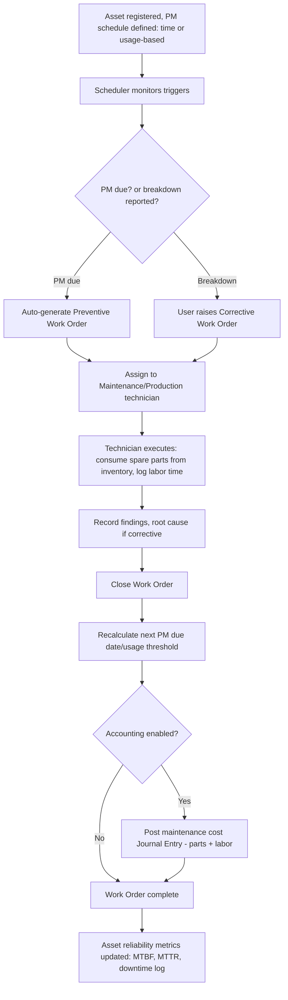

# 3. ERP Modules — Maintenance

## Purpose

Keep production equipment (and, where relevant, facility/fleet assets)
running reliably through scheduled preventive maintenance and tracked
corrective (breakdown) maintenance, minimizing unplanned production downtime
and linking maintenance cost back to Fixed Assets and Accounting.

## Business Process

1. Maintainable assets (machines, work centers, vehicles) are registered,
   optionally linked to a Fixed Asset record (`21-module-fixed-assets-depreciation.md`)
   for cost/depreciation tracking.
2. Preventive Maintenance (PM) schedules are defined per asset: time-based
   (every N days) or usage-based (every N operating hours/production
   cycles, fed from Production Order operation logs).
3. Scheduler auto-generates Maintenance Work Orders when a PM trigger is
   due; Production/Maintenance staff can also raise a Corrective Work Order
   ad-hoc when a breakdown occurs.
4. Work Order is assigned, executed (parts consumed from inventory, labor
   time logged), and closed with findings/next-due-date recalculated.
5. Asset downtime and maintenance cost roll up for reliability reporting
   (MTBF — Mean Time Between Failures, MTTR — Mean Time To Repair).

## Workflow

## Functional Requirements

| ID | Requirement |
|---|---|
| MAINT-F1 | System supports registering Maintainable Assets (machine, work center, vehicle, facility equipment), optionally linked to a Fixed Asset record. |
| MAINT-F2 | System supports Preventive Maintenance schedule definition per asset: time-based (interval in days) and/or usage-based (interval in operating hours or production cycle count), with multiple concurrent schedules per asset (e.g. daily check + monthly overhaul). |
| MAINT-F3 | System auto-generates a Preventive Work Order when a schedule's trigger condition is met (via Scheduler for time-based; via usage accumulation from Production Order operation logs for usage-based), assigned to a default technician/queue per asset. |
| MAINT-F4 | System supports manual Corrective (breakdown) Work Order creation at any time, with severity/priority classification and downtime start timestamp. |
| MAINT-F5 | System supports Work Order execution: checklist completion, spare-parts consumption (creates a `stock_movements` issue against the maintenance work order as reference), labor time logging (against a technician and optionally a labor cost rate). |
| MAINT-F6 | System supports Work Order closure with findings notes, root-cause classification for corrective orders, and automatic recalculation of the asset's next PM due date/usage threshold. |
| MAINT-F7 | System tracks asset downtime (from breakdown report to work order closure) and computes MTBF (Mean Time Between Failures) and MTTR (Mean Time To Repair) per asset and asset category. |
| MAINT-F8 | System supports Spare Parts inventory linkage (a subset of `products`, typically flagged `is_spare_part=true`) with min/max stock levels feeding reorder alerts specific to maintenance-critical parts. |
| MAINT-F9 | System generates a Maintenance Cost report per asset/period (parts cost + labor cost), feeding into Fixed Asset total-cost-of-ownership analysis and, if Accounting is enabled, posting to a configured Maintenance Expense account. |
| MAINT-F10 | System supports a Maintenance Calendar view (upcoming PM schedule across all assets) for planning and resource allocation. |

## Business Rules

1. An overdue Preventive Work Order (trigger date passed but not yet generated/actioned) is escalated with increasing urgency flagging rather than silently skipped — the system does not let a missed PM interval simply disappear.
2. Spare parts consumed on a Work Order follow the same negative-stock and batch/serial rules as any other stock issue (`06-module-inventory-stock.md`); maintenance does not get a special exemption.
3. A Corrective Work Order's downtime clock starts at the reported breakdown timestamp (which may be entered retroactively if reported late) and stops at Work Order closure — used for MTTR calculation; it is not based on Work Order creation time if those differ.
4. Closing a Work Order without recording any findings/notes is blocked for Corrective orders (root cause is mandatory for breakdown analysis) but optional for routine Preventive orders that passed all checklist items cleanly.
5. An asset's next PM due date/usage threshold recalculates only upon Work Order closure, not upon creation — an in-progress PM Work Order does not prematurely reset the schedule.
6. If Accounting and Fixed Assets are both enabled, maintenance cost postings are distinct from depreciation postings (maintenance is period expense, not capitalized into the asset's book value) unless a specific capital-improvement flag is set on the Work Order (rare, requires Finance approval), which does adjust the linked Fixed Asset's cost basis.

## Validation

| Field | Rules |
|---|---|
| `maintainable_asset.name` | Required. |
| `pm_schedule.trigger_type` | Enum: `time_based`, `usage_based`. |
| `pm_schedule.interval` | Required, > 0 (days for time-based, hours/cycles for usage-based). |
| `work_order.type` | Enum: `preventive`, `corrective`. |
| `work_order.priority` | Enum: `low`, `medium`, `high`, `critical` (required for corrective). |
| `work_order.downtime_start` | Required for corrective orders reporting downtime. |

## Permissions

| Permission Key | Description |
|---|---|
| `manufacturing.maintenance.asset.manage` | CRUD maintainable assets + PM schedules. |
| `manufacturing.maintenance.work-order.create` | Create Work Orders (preventive auto-gen, corrective manual). |
| `manufacturing.maintenance.work-order.execute` | Execute/log parts & labor on a Work Order. |
| `manufacturing.maintenance.work-order.close` | Close a Work Order. |
| `manufacturing.maintenance.report.view` | View MTBF/MTTR/cost reports. |

## Acceptance Criteria

- Given a time-based PM schedule of every 30 days last triggered on day 0, a Preventive Work Order auto-generates on day 30 without manual intervention.
- Given a usage-based PM schedule of every 500 operating hours, and Production Order operation logs accumulate 500 hours against the asset, a Preventive Work Order auto-generates at that threshold regardless of elapsed calendar time.
- Given a Corrective Work Order is created with breakdown reported at 09:00 and closed at 13:30, MTTR for this incident records as 4.5 hours.
- Given a Corrective Work Order is closed without any findings notes, the API returns `422 FINDINGS_REQUIRED`; the same closure without findings on a clean Preventive order succeeds.
- Given spare parts are consumed on a Work Order at a warehouse with `allow_negative_stock=false` and insufficient stock, the consumption is rejected with `INSUFFICIENT_STOCK`, same as any other module.

## API Requirements

| Method | Endpoint | Description |
|---|---|---|
| GET/POST | `/api/manufacturing/maintenance/assets` | List / register maintainable assets. |
| GET/POST | `/api/manufacturing/maintenance/assets/{id}/pm-schedules` | Manage PM schedules for an asset. |
| GET/POST | `/api/manufacturing/maintenance/work-orders` | List / create Work Orders. |
| GET | `/api/manufacturing/maintenance/work-orders/{id}` | View Work Order detail. |
| POST | `/api/manufacturing/maintenance/work-orders/{id}/issue-parts` | Consume spare parts. |
| POST | `/api/manufacturing/maintenance/work-orders/{id}/log-labor` | Log labor time. |
| POST | `/api/manufacturing/maintenance/work-orders/{id}/close` | Close with findings. |
| GET | `/api/manufacturing/maintenance/reports/reliability` | MTBF/MTTR per asset/category. |
| GET | `/api/manufacturing/maintenance/reports/cost` | Maintenance cost per asset/period. |
| GET | `/api/manufacturing/maintenance/calendar` | Upcoming PM schedule across assets. |

## UI Requirements

**Pages:** Maintainable Asset List/Detail (Tabs: General, PM Schedules,
Work Order History, Reliability Metrics, Linked Fixed Asset), PM Schedule
configuration, Work Order List (Table, filters: type/status/priority/asset),
Work Order Create/Execute (checklist + parts issue + labor log form), Work
Order Detail, Maintenance Calendar (month/week view), Reliability & Cost
report dashboards.

**Components (FlyonUI):** Data Table, Calendar component (PM schedule
view, color-coded by asset/urgency), Drawer/form (Work Order execution:
checklist items as toggle list, parts-issue line grid, labor-time entry),
Badge (priority: low/medium/high/critical color-coded; status:
scheduled/overdue/in_progress/closed), Timeline (asset maintenance history),
Chart (MTBF/MTTR trend, cost-per-asset bar chart), Toast, Empty State ("No
maintainable assets registered yet").
