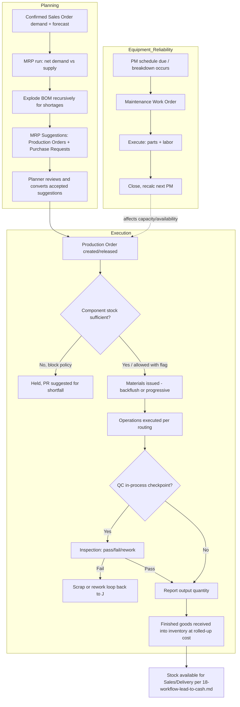

# 5. Complete Business Workflow — Manufacturing

End-to-end flow tying together every module delivered in Phase 5 (`23`
through `26`). Individual module documents contain the detailed per-module
workflow; this view shows how they chain together.

## Control Points Summary

| Gate | Enforced In | Rule Reference |
|---|---|---|
| Human review before binding PR/Production Order creation | MRP module | MRP Business Rule #1 |
| Component shortage policy (block/allow-with-flag) | Production Order module | PROD-F3 |
| Negative-stock prevention on material issue | Production Order + Inventory | PROD Business Rule #2 |
| Circular BOM prevention | BOM module | BOM Business Rule #7 |
| Over-production tolerance | Production Order module | PROD Business Rule #3 |
| QC in-process disposition gate | Quality Control module | QC Business Rule #1–2 |
| NCR permanence / mandatory root cause | Quality Control module | QC Business Rule #5 |
| PM schedule cannot silently lapse | Maintenance module | MAINT Business Rule #1 |
| Mandatory findings on corrective Work Order closure | Maintenance module | MAINT Business Rule #4 |

This phase connects backward into `12-workflow-procure-to-pay.md` (component
shortages become Purchase Requests) and forward into
`18-workflow-lead-to-cash.md` (finished goods become sellable stock),
making Manufacturing the structural bridge between the two core commercial
loops.
